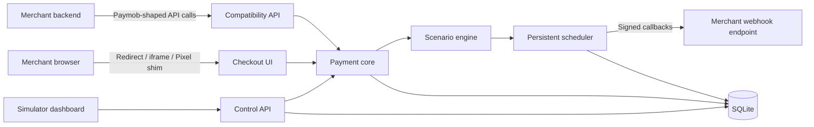

# Paymob Simulator

## Implementation specification for an unofficial, local-first payment emulator

- **Document status:** Build-ready specification
- **Target release:** `v1.0.0`
- **Last reviewed:** 2026-08-14
- **Primary audience:** The implementation agent responsible for creating the complete standalone project

---

## 1. Build mandate

Build a standalone, Dockerized, local-first Paymob emulator named **Paymob Simulator**. A developer must be able to point a development application at the simulator instead of Paymob, create a payment, open a hosted or embedded checkout, enter a scenario-specific test card, and observe realistic browser redirects and HMAC-signed backend callbacks.

The finished product must provide:

1. A Paymob-compatible HTTP API for the supported modern and legacy payment flows.
2. A hosted checkout page and iframe-compatible checkout page.
3. Scenario selection through memorable, fictional test card numbers.
4. Immediate, delayed, missing, duplicated, invalidly signed, and reordered callbacks.
5. Persistent transactions and scheduled deliveries that survive container restarts.
6. A web dashboard for setup, scenarios, transactions, callbacks, replay, and time control.
7. A simulator-only control API for deterministic automated and CI testing.
8. A single Docker image with no required external database, queue, or cloud account.

The primary experience is HTTP and browser based. A CLI is not required for `v1`; all operations must be available through the UI and HTTP APIs.

If this document is handed to an autonomous coding agent, that agent should implement all `v1` requirements, tests, documentation, and container packaging without requesting routine product decisions. Items explicitly marked “Future” are not part of `v1`.

---

## 2. Product statement

### Problem

Paymob provides a sandbox, test credentials, and webhook guidance, but developers cannot deterministically ask it to deliver a success callback in two minutes, omit a callback, deliver duplicates, corrupt an HMAC, reorder state transitions, or replay a transaction locally. Teams therefore create one-off payload scripts and incomplete mocks, leaving important payment behavior untested.

### Solution

Paymob Simulator runs locally as a container and behaves like a controllable payment provider:

```text
Application backend
    -> creates a payment against Paymob Simulator
    <- receives a client secret / payment token

Application browser
    -> opens simulator checkout or iframe
    -> enters a scenario test card
    <- returns to the configured merchant result URL

Paymob Simulator
    -> sends a valid or intentionally malformed Paymob-shaped callback
    -> waits, retries, duplicates, omits, or reorders it according to the scenario
```

### Positioning

This is an **unofficial development and testing tool**. It is not affiliated with Paymob, is not a payment processor, must never move money, and must never proxy requests to Paymob production.

---

## 3. Success criteria

A new user succeeds when they can:

1. Start the image with one Docker command.
2. Open `http://localhost:8080/__simulator` and complete first-run setup.
3. Set their application's Paymob API and checkout base URLs to the simulator.
4. Create an intention through their existing backend code.
5. Open Unified Checkout, a legacy iframe, or the simulator Pixel shim.
6. Choose or enter a documented scenario card.
7. See their browser redirect independently of the backend callback.
8. Inspect the signed callback, delivery timing, attempts, and backend response in the dashboard.
9. Replay the callback or advance virtual time without restarting anything.
10. Commit exported YAML scenarios so the same behavior runs on every machine and in CI.

The emulator is considered useful only if the merchant application does not need simulator-specific fields in its normal Paymob requests.

---

## 4. Scope

### 4.1 Required in `v1`

Build `v1` through two mandatory gates so compatibility breadth does not weaken the core:

- **Gate A (`v0.1`, core product):** modern intention create/update, Unified Checkout, known scenario cards, browser redirect, transaction callback + exact HMAC, durable delays/retries/duplicates/omissions, SQLite, setup/settings, transaction/delivery dashboard, manual clock, control-plane completion/expectations, Docker, and the demo merchant. All Gate A acceptance tests must pass before Gate B starts.
- **Gate B (`v1.0`, compatibility completion):** pinned Pixel facade, deprecated legacy auth/order/payment-key/raw iframe profile, token callback/saved-token subset, inquiry/refund/void/capture, 3DS fixtures, custom scenario authoring/import/export, and the remaining hardening/documentation below.

Both gates are required for this specification's final definition of done. The implementation agent should create an internal checkpoint after Gate A and continue to Gate B; it must not implement Gate B as stubs while core scheduling/HMAC tests are failing.

- Modern Intention API subset.
- Unified Checkout redirect flow.
- Pixel-compatible embedded shim for the documented subset in this specification.
- Legacy authentication, order, payment-key, and iframe flow.
- Card checkout scenarios.
- Browser redirection callback behavior.
- Transaction processed webhook payloads.
- Transaction HMAC-SHA512 signing.
- Card-token webhook signing for a minimal save-card flow.
- Transaction inquiry.
- Refund, partial refund, void, and capture actions at simulator level.
- Immediate and persisted delayed delivery.
- Retry, duplicate, omission, invalid signature, and out-of-order delivery.
- SQLite persistence and schema migrations.
- Admin dashboard and simulator control API.
- Real clock and manually advanced test clock.
- One multi-stage Docker image.
- Docker Compose example.
- Unit, integration, browser E2E, and container smoke tests.
- OpenAPI documentation for simulator and supported provider-compatible endpoints.

### 4.2 Explicit non-goals for `v1`

- Processing real cards or real money.
- Proxying unimplemented calls to any Paymob environment.
- Pixel SDK parity beyond the documented compatibility subset below.
- Native iOS, Android, Flutter, or React Native SDK emulation.
- Full wallet, kiosk, BNPL, installment, Apple Pay, or Google Pay behavior.
- Bank/acquirer network emulation.
- Real fraud scoring or production-grade 3-D Secure.
- Full subscriptions and recurring billing.
- Settlement, payout, split-payment, or accounting simulation.
- Pixel-perfect copying of Paymob's branding or hosted checkout UI.
- A guarantee that every response matches every Paymob account, region, or historical API version.
- Multi-tenant hosted SaaS operation.

### 4.3 Compatibility philosophy

The simulator must be honest about compatibility:

- `v1` is a behavioral emulator and a high-value API subset, not a complete clone.
- Unknown JSON fields should normally be preserved or ignored, not rejected.
- Required fields and authentication should be validated in realistic mode.
- Exact response fixtures must be documented and regression tested.
- Account-specific or undocumented Paymob behavior must be marked as simulator behavior rather than claimed as Paymob behavior.
- The README must maintain a compatibility table with `supported`, `partial`, and `not supported` labels.

### 4.4 Named compatibility profiles

Implement two explicit profiles that share the same core and scenario engine:

1. `paymob-egypt-intention-v1` — enabled by default. This is the current card profile: Intention API, Unified Checkout, the documented Pixel subset, backend transaction callback, and browser redirect.
2. `paymob-egypt-legacy-iframe-v1` — implemented in `v1` but disabled by default. This is migration compatibility for auth -> order -> payment key -> raw iframe integrations. Enable it with `SIM_ENABLE_LEGACY=1` or the dashboard.

Current Paymob guidance treats the Intention API as the current creation flow and recommends Unified Checkout or Pixel rather than a raw iframe. Every legacy UI, route, example, and compatibility entry must therefore be labeled **deprecated compatibility**, not presented as current integration guidance.

The initial profile targets Egypt and defaults to EGP. It may accept other ISO currencies as test data, but the project must not claim verified UAE, KSA, or Oman parity until separate fixtures and profiles exist.

---

## 5. Key user journeys

### 5.1 Delayed backend success

```text
T+0.0s   Merchant creates an intention.
T+1.0s   Customer submits the delayed-success card; call this instant S.
S+0.5s   Browser returns to the merchant with a pending result.
S+119s   Merchant payment remains pending; no fulfillment occurs.
S+120s   Exactly two minutes after submission, simulator sends a valid success callback.
S+121s   Merchant marks the payment successful and fulfills once.
```

### 5.2 Duplicate success

```text
T+0s     Simulator sends a valid success callback.
T+5s     Simulator sends the exact same callback again.
T+30s    Simulator sends it a third time.
```

The merchant should update and fulfill exactly once.

### 5.3 Missing callback

The browser sees a configured outcome, but the backend callback is never created. The merchant must remain pending or reconcile through transaction inquiry.

### 5.4 Invalid callback

The simulator sends a realistic payload with an intentionally corrupted HMAC. The merchant must reject it and make no state change.

### 5.5 Provider retry

The merchant callback endpoint returns a configured retryable status or a transport error. The simulator records the attempt and retries on the configured schedule. By default only transport errors and `[408, 425, 429, 500, 502, 503, 504]` retry; other `3xx`, `4xx`, and `5xx` responses are terminal unless explicitly added. Redirects are never followed. The policy is explicitly simulator-configurable because Paymob's exact retry behavior is not treated as a stable public contract.

### 5.6 Embedded checkout

The merchant mounts the simulator checkout inside an iframe or Pixel shim. The frame posts status messages to the parent, the browser UX completes, and the server callback is scheduled independently.

---

## 6. System architecture

Use one repository and one deployable container.



### 6.1 Data plane

Routes intended to resemble Paymob and be called by merchant code:

- Modern intention routes.
- Unified Checkout.
- Embedded SDK asset and frame.
- Legacy authentication/order/payment-key/iframe routes.
- Transaction inquiry and management routes.

### 6.2 Control plane

Namespaced simulator-only routes under `/__simulator`:

- Setup and settings.
- Scenario CRUD/import/export.
- One-shot expectations.
- Transaction inspection.
- Callback inspection/replay/cancel.
- Manual clock control.
- Data reset.
- Server-sent live events.

No control-plane fields may be required in a provider-compatible request.

### 6.3 Runtime processes

One Node.js process may host the API, static dashboard, checkout pages, and scheduler. A separate Redis or worker container is forbidden for `v1`.

The scheduler must use persisted jobs and leases; it must not depend solely on `setTimeout`.

---

## 7. Prescribed technology stack

Use current stable, mutually compatible releases and commit the lockfile.

- **Runtime:** Node.js 22 or later LTS, TypeScript with strict mode.
- **Package manager:** pnpm.
- **HTTP server:** Fastify.
- **Dashboard and checkout:** React + Vite + React Router.
- **Client data fetching:** TanStack Query.
- **Validation:** Zod schemas shared between server and UI where practical.
- **Database:** SQLite in WAL mode.
- **ORM/migrations:** Drizzle ORM and Drizzle migrations.
- **SQLite driver:** `better-sqlite3`, using a Debian slim image rather than Alpine to reduce native-module friction.
- **Logging:** Pino structured logs with secret/PAN redaction.
- **API documentation:** OpenAPI 3.1 and a bundled interactive viewer.
- **Unit/integration tests:** Vitest.
- **Browser tests:** Playwright.
- **Formatting/linting:** Prettier and ESLint with TypeScript rules.
- **Container tests:** Docker Compose smoke script in CI.

Do not introduce Redis, Postgres, Kafka, Temporal, or another infrastructure dependency in `v1`.

### 7.1 Suggested repository layout

```text
paymob-simulator/
├── apps/
│   ├── server/
│   │   ├── src/
│   │   │   ├── compatibility/
│   │   │   │   ├── modern/
│   │   │   │   ├── legacy/
│   │   │   │   └── webhooks/
│   │   │   ├── control-plane/
│   │   │   ├── core/
│   │   │   ├── database/
│   │   │   ├── scheduler/
│   │   │   ├── security/
│   │   │   └── index.ts
│   │   └── tests/
│   └── web/
│       ├── src/
│       │   ├── admin/
│       │   ├── checkout/
│       │   ├── embed-sdk/
│       │   └── shared/
│       └── tests/
├── packages/
│   ├── contracts/
│   ├── scenario-engine/
│   └── test-fixtures/
├── config/
│   ├── config.example.yaml
│   └── scenarios/
├── migrations/
├── docs/
├── e2e/
├── Dockerfile
├── docker-compose.example.yml
├── package.json
├── pnpm-workspace.yaml
├── README.md
├── LICENSE
└── SECURITY.md
```

A simpler internal layout is acceptable if it keeps the same boundaries and avoids coupling Paymob response adapters to the core state machine.

---

## 8. Configuration model

### 8.1 Configuration precedence

Use this precedence, highest first:

1. Per-intention URLs and per-transaction scenario expectation.
2. Environment variables explicitly marked as locked.
3. Mounted `/config/config.yaml` values.
4. Runtime settings saved through the dashboard.
5. Built-in defaults.

The settings UI must show the effective value and its source. Environment- and mounted-file-controlled settings must be visible but not editable. If no mounted configuration exists, SQLite/UI settings are mutable. Do not silently write UI changes back into a mounted file.

### 8.2 Example configuration

```yaml
version: 1

server:
  publicUrl: http://localhost:8080
  port: 8080

credentials:
  secretKey: sk_sim_local
  publicKey: pk_sim_local
  apiKey: api_sim_local
  hmacSecret: sim_hmac_secret

defaults:
  currency: EGP
  scenario: success-immediate
  notificationUrl: http://host.docker.internal:3000/webhooks/paymob
  redirectionUrl: http://localhost:3000/payment/result
  redirectMode: paymob_query_order
  validationMode: realistic

integrations:
  - id: 1001
    iframeId: 2001
    name: Local cards
    paymentMethod: card
    sourceSubtype: Visa
    iframeCompletionMode: post_message_and_redirect
    notificationUrl: http://host.docker.internal:3000/webhooks/paymob
    redirectionUrl: http://localhost:3000/payment/result

delivery:
  requestTimeout: 10s
  retryOnTransportError: true
  retryOnStatuses: [408, 425, 429, 500, 502, 503, 504]
  retryIntervals: [5s, 30s, 2m]
  maxAttempts: 4

browser:
  allowedFrameAncestors:
    - http://localhost:3000
    - http://localhost:5173
  allowedRedirectOrigins:
    - http://localhost:3000
    - http://localhost:5173

security:
  allowedWebhookHosts:
    - backend
    - host.docker.internal
    - localhost
    - 127.0.0.1
  allowPrivateNetworks: true
  adminToken: null

clock:
  mode: real
  manualStart: 2026-01-01T00:00:00.000Z
```

### 8.3 Environment variables

Support at minimum:

```text
SIM_PORT
SIM_PUBLIC_URL
SIM_DATA_DIR
SIM_CONFIG_FILE
SIM_SECRET_KEY
SIM_PUBLIC_KEY
SIM_API_KEY
SIM_HMAC_SECRET
SIM_ADMIN_TOKEN
SIM_DEFAULT_NOTIFICATION_URL
SIM_DEFAULT_REDIRECTION_URL
SIM_ALLOWED_WEBHOOK_HOSTS
SIM_ALLOWED_REDIRECT_ORIGINS
SIM_ALLOWED_FRAME_ANCESTORS
SIM_VALIDATION_MODE
SIM_CLOCK_MODE
SIM_LOG_LEVEL
SIM_ENABLE_LEGACY
SIM_ENABLE_PIXEL_SHIM
SIM_TLS_CERT_FILE
SIM_TLS_KEY_FILE
```

Comma-separated allowlists are acceptable in environment variables. YAML remains the richer configuration format.

### 8.4 First-run setup

If no configuration exists, authentication is bootstrapped **before** any setup mutation is allowed:

1. On first process start, generate a 32-byte random bootstrap token, store only its Argon2id hash, and print the plaintext token once to the terminal.
2. `GET /__simulator/setup` may render without authentication, but it contains no secrets and cannot change state.
3. The page asks for the terminal token. `POST /__simulator/api/auth/bootstrap` accepts `{ "token": "..." }`, compares it in constant time, atomically consumes it, and creates the first 12-hour admin session cookie plus a CSRF token.
4. All setup writes then use that authenticated session. There is no unauthenticated settings route.
5. If the token is lost before exchange, restarting with `SIM_ADMIN_TOKEN=<new-random-value>` replaces the unused bootstrap hash. If all admin access is later lost, setting `SIM_ADMIN_TOKEN` and restarting creates a new bearer/login credential without resetting payment data.

The authenticated setup wizard then:

1. Generates fictional simulator credentials.
2. Requests default backend callback and browser redirection URLs.
3. Explains host-versus-container URLs.
4. Tests callback reachability without sending a payment event.
5. Lets the user select real or manual clock mode.
6. Shows copyable environment variables for the merchant application.
7. Shows how to preserve or explicitly configure the admin recovery token for later logins.

The server APIs must still be usable headlessly with configuration supplied by file or environment variables.

`/healthz` returns `200` as soon as the process and SQLite are alive. `/readyz` returns `503 { "ready": false, "reason": "setup_required" }` until setup or headless configuration is complete. Invalid mounted configuration or scenario YAML also leaves `/readyz` at `503`, while the health route and read-only setup diagnostics remain available. Provider-compatible routes return `503 { "detail": "simulator setup is incomplete" }` until ready.

Configuration locking is per leaf path, not per section. An environment variable locks only the leaf it supplies; a mounted YAML leaf is visible but read-only in the UI. A mounted scenario ID wins over a SQLite scenario ID only when the mounted definition contains `overrideBuiltIn: true` for a built-in or `overrideDatabase: true` for a database scenario; otherwise startup fails readiness with a collision error. UI-created scenarios can never override mounted or built-in definitions in place: the user must choose a new ID.

---

## 9. Paymob-compatible surface

### 9.1 Modern flow: required routes

| Method | Route | Requirement |
|---|---|---|
| `POST` | `/v1/intention/` | Create and persist an intention. |
| `PUT` | `/v1/intention/:clientSecret` | Update an uncompleted intention's supported fields. |
| `GET` | `/v1/intention/:id` | Simulator-supported, secret-key-authenticated retrieval extension. |
| `GET` | `/v1/intention/element/:publicKey/:clientSecret/` | Public checkout projection used by the pinned embedded shim; never returns billing data or secrets. |
| `PATCH` | `/v1/intention/element/:publicKey/:clientSecret/` | Simulator-defined Pixel update subset; only the pinned shim should call it. |
| `GET` | `/unifiedcheckout/` | Render hosted checkout using `publicKey` and `clientSecret`. |
| `GET` | `/unifiedcheckout/static/scripts/paymob-sdk.js` | Serve Pixel compatibility shim. |
| `GET` | `/embed/:clientSecret` | Render the iframe used by the shim. |

#### Authentication

`POST` and `PUT` intention requests require:

```http
Authorization: Token sk_sim_local
```

Realistic mode returns:

- `401` for absent or invalid authorization.
- `404` when configured integration IDs are missing or unknown.
- `406` with code `unmatched_item_prices` when supplied item totals do not equal the intention amount.
- `422` for invalid field types or missing the minimum fields `amount`, `currency`, and `payment_methods`.

Current official Paymob-owned examples disagree about whether all items and full billing-address fields are mandatory. Therefore:

- Default `realistic` mode requires `amount`, `currency`, and non-empty `payment_methods`; accepts partial billing data used by official client packages; and validates item totals only when `items` are present.
- Optional `strict_docs` mode requires the complete billing and item shape shown in current documentation.
- `permissive` mode requires only a positive integer amount and currency and ignores unknown integration IDs.

`validationMode` is an enum with exactly those three values: `realistic`, `strict_docs`, or `permissive`. There is no separate unnamed “strict compatibility” mode.

When `items` are present, validate `sum(item.amount * item.quantity) == intention.amount`, using integer arithmetic. `quantity` defaults to `1`, must be a positive integer, and `item.amount` must be a non-negative integer. An empty item list is allowed in `realistic` and `permissive` modes. Reject overflow beyond JavaScript's safe integer range before calculation.

Never accept a key that looks like `sk_live_*` unless an explicit unsafe override is enabled. The dashboard must warn prominently if the override is used.

Freeze these simulator error bodies and cover them with contract tests:

```json
// 401
{ "detail": "incorrect credentials" }

// 404
{ "detail": "Integration not found" }

// 406
{ "detail": "unmatched_item_prices", "code": "unmatched_item_prices" }

// 422
{
  "detail": [
    {
      "loc": ["body", "amount"],
      "msg": "amount must be a positive integer in the smallest currency unit",
      "type": "value_error"
    }
  ]
}
```

These are frozen simulator compatibility fixtures; do not claim that every Paymob region/account returns identical error bodies.

#### Create-intention request subset

Accept and preserve at least:

```json
{
  "amount": 10000,
  "currency": "EGP",
  "payment_methods": [1001],
  "items": [
    {
      "name": "Order item",
      "amount": 10000,
      "description": "Example",
      "quantity": 1
    }
  ],
  "billing_data": {
    "first_name": "Test",
    "last_name": "Customer",
    "email": "test@example.com",
    "phone_number": "+201000000000",
    "apartment": "NA",
    "floor": "NA",
    "street": "NA",
    "building": "NA",
    "shipping_method": "NA",
    "postal_code": "NA",
    "city": "Cairo",
    "country": "EG",
    "state": "Cairo"
  },
  "customer": {
    "first_name": "Test",
    "last_name": "Customer",
    "email": "test@example.com"
  },
  "special_reference": "ORDER-123",
  "notification_url": "http://backend:3000/webhooks/paymob",
  "redirection_url": "http://localhost:3000/payment/result",
  "expiration": 3600,
  "extras": {
    "merchant_data": "preserve-me"
  }
}
```

The amount is always an integer in the currency's smallest unit.

Validation is exact:

- `amount` is a positive safe integer; `currency` is an uppercase three-letter ASCII code. The Egypt profile defaults to EGP but permits other syntactically valid currencies as simulator test data and labels them unverified.
- In `realistic` and `strict_docs`, `payment_methods` is a non-empty unique array of positive configured integration IDs. In `permissive`, unknown positive IDs are retained and projected with a generated simulator integration record.
- `realistic` does not require `items`, `billing_data`, or `customer`; when present, known fields must have the documented primitive type and email/phone are syntax-checked leniently. `strict_docs` requires at least one item; every billing field shown in the fixture as a non-empty string; and customer `first_name`, `last_name`, and `email`.
- Effective URL precedence is request field -> selected integration snapshot -> global default. An explicit request `null` does not disable a configured URL; omission falls through. To omit an action, use a scenario.
- `notification_url` must pass URL normalization and hostname allowlist rules in section 20.2 at create/update time and the full DNS/IP/pinned-connection rules at delivery time. Creation may succeed while an allowlisted hostname is temporarily unresolved; that becomes an inspectable delivery transport failure. A syntactically or policy-rejected provider request returns `422` with location `notification_url` and code `callback_target_not_allowed`.
- `redirection_url` must be absolute HTTP(S), contain no userinfo, and its normalized `scheme://host:port` must exactly match an `allowedRedirectOrigins` entry. Paths and query strings are allowed; fragments are removed. Rejection is `422` with code `redirect_origin_not_allowed`.
- Unknown JSON keys are preserved in a size-limited raw-request snapshot but otherwise ignored. JSON body size defaults to 256 KiB; strings default to a 4,096-byte UTF-8 cap unless a smaller field cap is stated.

`expiration` is seconds from creation, defaults to `3600`, and is accepted in the inclusive range `60..86400`. An intention starts as `intended`, expires at `created_at + expiration`, and allows exactly one successful checkout submission. Merely opening or refreshing checkout does not consume it. The first atomic submit creates one transaction and marks the checkout token consumed; concurrent/double submits return the already-created transaction result with HTTP `200` when the same checkout session idempotency key is supplied, otherwise HTTP `409 { "detail": "intention already submitted" }`. Expired checkout and update attempts return `410 { "detail": "intention expired" }`.

#### Create-intention response

In `realistic`/`strict_docs` mode, return HTTP `201` with provider-compatible fields only. The frozen default fixture supports both the documented minimum and the current official PHP client's use of `intention_detail.amount`:

```json
{
  "id": "pi_sim_01J5A7V8M8QK6R2D1N4B9C3E5F",
  "client_secret": "csk_test_sim_01J5A7V8M8QK6R2D1N4B9C3E5F",
  "intention_detail": {
    "amount": 10000,
    "currency": "EGP"
  }
}
```

Do not add simulator-only JSON fields to `realistic` or `strict_docs` responses. For debugging, the simulator may add this response header:

```http
X-Paymob-Simulator-Checkout-URL: http://localhost:8080/unifiedcheckout/?publicKey=pk_sim_local&clientSecret=...
```

Clients construct the standard-shaped Unified Checkout URL themselves:

```text
{SIM_PUBLIC_URL}/unifiedcheckout/?publicKey={public_key}&clientSecret={client_secret}
```

The modern-route contracts are frozen as follows:

- `PUT /v1/intention/:clientSecret` requires the same secret-key header as create, accepts a non-empty partial object containing any of `amount`, `currency`, `payment_methods`, `items`, `billing_data`, `customer`, `special_reference`, `notification_url`, `redirection_url`, `expiration`, or `extras`, and returns HTTP `200` with the same response shape as create. It is allowed only before the first checkout submission. Item totals are revalidated against the resulting merged object. Unknown fields are preserved under the stored raw request but omitted from the response. Invalid/unknown secret is `404`; immutable/submitted is `409`; expired is `410`.
- `GET /v1/intention/:id` requires the secret-key header and returns HTTP `200` with the create response plus `status`, `special_reference`, `created_at`, and `expires_at`. Unknown ID is `404`. This route is explicitly a simulator extension and merchant correctness must not depend on it.
- `GET /v1/intention/element/:publicKey/:clientSecret/` requires no secret key. The public key and client secret must belong to the same configured profile. It returns HTTP `200 { "id", "amount", "currency", "status", "special_reference", "expires_at", "payment_methods" }`; it never returns callback URLs, billing/customer data, extras, or credentials. Mismatch/unknown is `404`; expired is `410`.
- All JSON mutation routes require `Content-Type: application/json`; malformed JSON is `400`, schema failure is `422`, and unsupported media type is `415`.

### 9.2 Legacy flow: required routes

Legacy support matters because many existing Egyptian integrations still use the older iframe sequence, even though current Paymob guidance favors the Intention API. The order, payment-key, and raw-iframe routes are served only when the deprecated legacy profile is enabled. `/api/auth/tokens` and transaction inquiry remain enabled for the modern profile because current inquiry guidance still uses a short-lived auth token. Refund, void, capture, and saved-token payment remain enabled as current management surfaces; accepting their legacy body-auth aliases depends on the legacy flag.

| Method | Route | Required behavior |
|---|---|---|
| `POST` | `/api/auth/tokens` | Accept `api_key`, return a short-lived simulator token. |
| `POST` | `/api/ecommerce/orders` | Create an order using `auth_token`. |
| `POST` | `/api/acceptance/payment_keys` | Create a payment token tied to an order and integration. |
| `GET` | `/api/acceptance/iframes/:iframeId` | Render checkout using `payment_token`. |
| `POST` | `/api/acceptance/payments/pay` | Minimal saved-token/off-session charge support. |
| `GET` | `/api/acceptance/transactions/:id` | Return current transaction state. |
| `POST` | `/api/acceptance/void_refund/refund` | Full or partial refund. |
| `POST` | `/api/acceptance/void_refund/void` | Void an eligible transaction. |
| `POST` | `/api/acceptance/capture` | Capture an authorized transaction. |

#### Legacy response minimums

All legacy JSON routes require `Content-Type: application/json`. Freeze these request subsets:

```json
// POST /api/auth/tokens
{ "api_key": "api_sim_local" }

// POST /api/ecommerce/orders
{
  "auth_token": "auth_sim_...",
  "delivery_needed": false,
  "amount_cents": 10000,
  "currency": "EGP",
  "merchant_order_id": "ORDER-123",
  "items": []
}

// POST /api/acceptance/payment_keys
{
  "auth_token": "auth_sim_...",
  "amount_cents": 10000,
  "expiration": 3600,
  "order_id": 700001,
  "billing_data": {
    "first_name": "Test",
    "last_name": "Customer",
    "email": "test@example.com",
    "phone_number": "+201000000000"
  },
  "currency": "EGP",
  "integration_id": 1001
}
```

The auth route returns `201`; order and payment-key creation return `201`. A legacy auth token lives for 60 minutes and may be reused during that period. A payment token uses its request `expiration` in seconds, default `3600`, range `60..86400`, and is single-submit exactly like a modern client secret. The order amount/currency, payment-key amount/currency, and configured integration must match; mismatch is HTTP `400 { "message": "amount, currency, order, or integration mismatch" }`. Missing/expired auth is `401`, unknown order/integration/iframe is `404`, expired payment token is `410`, and double submission without the same checkout-session idempotency key is `409`.

Every enabled legacy integration must declare a unique positive integer `iframeId`. `/api/acceptance/iframes/:iframeId` verifies that the supplied payment token belongs to the integration mapped to that iframe ID. A token cannot be moved between iframe IDs. The integration snapshot supplies its notification and redirection URLs for the resulting transaction.

Authentication:

```json
{
  "token": "auth_sim_01J5A7V8M8QK6R2D1N4B9C3E5F",
  "profile": { "id": 500001 }
}
```

Order:

```json
{
  "id": 700001,
  "created_at": "2026-08-14T12:00:00.000Z",
  "delivery_needed": false,
  "amount_cents": 10000,
  "currency": "EGP",
  "merchant_order_id": "ORDER-123",
  "items": []
}
```

Payment key:

```json
{
  "token": "pt_sim_01J5A7V8M8QK6R2D1N4B9C3E5F"
}
```

Legacy iframe URL:

```text
{SIM_PUBLIC_URL}/api/acceptance/iframes/{iframe_id}?payment_token={payment_token}
```

For the legacy flow, callback and redirect URLs come from the selected integration snapshot. The frozen legacy provider request does not define URL override fields; configure them in the simulator or use the control plane rather than inventing provider fields.

### 9.3 Transaction inquiry and management operations

Transaction inquiry returns the same normalized transaction object used under the webhook's `obj` field, without the outer `{ "type": "TRANSACTION", "obj": ... }` envelope.

Inquiry authentication placement is not stable enough across official examples to enforce only one form. First issue a short-lived token through `POST /api/auth/tokens`, then accept that token through all of these compatibility forms on inquiry:

```text
?token=auth_sim_...
Authorization: Bearer auth_sim_...
Authorization: Token auth_sim_...
```

Record which form was used. The compatibility document must name one canonical form per frozen profile while keeping the tolerant aliases.

Inquiry returns HTTP `200` for an existing transaction, `401` for an absent/invalid/expired auth token, and `404 { "detail": "Transaction not found" }` otherwise. Numeric IDs are canonical; non-numeric IDs are `422`. The returned body is exactly the normalized `obj` projection, including child/aggregate fields described in section 13.

Current-style management authentication:

```http
Authorization: Token sk_sim_local
```

Refund:

```http
POST /api/acceptance/void_refund/refund
Content-Type: application/json

{ "transaction_id": 900001, "amount_cents": 5000 }
```

Void:

```http
POST /api/acceptance/void_refund/void
Content-Type: application/json

{ "transaction_id": 900001 }
```

Capture:

```http
POST /api/acceptance/capture
Content-Type: application/json

{ "transaction_id": 900001, "amount_cents": 10000 }
```

Refund/capture validate positive safe-integer `amount_cents`; void accepts no amount. Unknown transaction is `404`, invalid auth is `401`, schema failure is `422`, and state/remaining-total conflict is `409`. The operation endpoints are idempotent only when the caller supplies `Idempotency-Key` (ASCII, 1..128 characters): replaying the same key and byte-identical request returns the original child with `200`; reusing it with different bytes returns `409`. Without that header, each valid request attempts a new operation under the state rules.

Saved-token payment has two accepted compatibility forms and must not confuse an intention client secret with a legacy payment key. Modern form:

```http
POST /api/acceptance/payments/pay
Content-Type: application/json

{
  "source": {
    "identifier": "tok_sim_01J5A7V8M8QK6R2D1N4B9C3E5F",
    "subtype": "TOKEN"
  },
  "payment_token": "csk_test_sim_01J5A7V8M8QK6R2D1N4B9C3E5F"
}
```

Deprecated legacy form is identical except `payment_token` is `pt_sim_...` and is accepted only when the legacy profile is enabled. The source token must be active and belong to the same simulator profile. Success returns HTTP `201` with the normalized transaction; invalid source token is `404`, expired/consumed payment token is `410`/`409`, and a profile mismatch is `400`.

For migration compatibility, management endpoints may also accept a valid legacy `auth_token` request-body field when the legacy profile is enabled. Successful refund/capture/void operations return HTTP `201` with the created child transaction defined in section 13.4; inquiry of the original returns its recomputed aggregate. Validate totals, prevent incompatible operations, and return `409` with a clear simulator-defined error when a state invariant fails.

### 9.4 Unknown routes

Return a Paymob-like JSON error plus a simulator diagnostic header:

```http
X-Paymob-Simulator: unsupported-route
```

Never forward the request to the internet.

---

## 10. Checkout presentation

Use one shared checkout engine and three presentation adapters.

### 10.1 Unified Checkout

`GET /unifiedcheckout/?publicKey=...&clientSecret=...` renders a full-page hosted checkout.

It must show:

- An unmistakable **SIMULATOR — NO REAL PAYMENT** banner.
- Merchant reference, amount, and currency.
- Card number, cardholder name, expiry, and CVV fields.
- Optional save-card checkbox when requested.
- A collapsible test-scenario card catalog with copy buttons.
- A payment-processing state.
- A cancel action.
- Clear errors for expired, reused, or invalid client secrets.

Do not copy Paymob's logo, visual identity, or proprietary UI. Use neutral developer-tool styling.

### 10.2 Legacy iframe

`GET /api/acceptance/iframes/:iframeId?payment_token=...` renders the same checkout content in an iframe-optimized shell.

Requirements:

- No `X-Frame-Options: DENY`.
- CSP `frame-ancestors` generated from the configured allowlist.
- Responsive height messages to the parent.
- No dependency on third-party cookies.
- The payment token identifies all server-side state.
- Configurable completion behavior: stay in frame, redirect frame, redirect top window, post a message, or post a message then redirect.

### 10.3 Pixel compatibility shim

Serve a small JavaScript shim at:

```text
/unifiedcheckout/static/scripts/paymob-sdk.js
```

Support this subset:

```js
const paymob = Paymob.init({
  publicKey: "pk_sim_local",
  clientSecret,
  paymentMethods: ["card"],
  elementId: "paymob-container",
  disablePay: false,
  showSaveCard: false,
  forceSaveCard: false,
  beforePaymentComplete: async () => true,
  afterPaymentComplete: result => console.log(result),
  onPaymentCancel: () => console.log("cancelled"),
  cardValidationChanged: isValid => console.log(isValid),
  customStyle: {}
});

paymob.payFromOutside();
paymob.updateIntentionData({ amount: 15000 });
paymob.destroy();
```

The shim mounts `/embed/:clientSecret` in an iframe and communicates with exact-origin `postMessage` events. It must not claim full Paymob Pixel compatibility.

Version the facade independently, beginning with `pixel-sim-v1`. Expose the version in the script header, dashboard, and `COMPATIBILITY.md`. Paymob's real Pixel URL, constructor options, and callbacks are versioned and may change, so transparent compatibility with unspecified releases is expressly not promised. Keep the shim behind `SIM_ENABLE_PIXEL_SHIM=1`, enabled by default for the modern simulator profile but independently disableable.

Supported frame-to-parent events:

```text
checkout.ready
checkout.resized
card.validation_changed
payment.processing
payment.pending
payment.succeeded
payment.failed
payment.cancelled
three_ds.opened
three_ds.completed
```

Every message includes `source: "paymob-simulator"`, `clientSecret`, and a versioned payload.

Freeze the `pixel-sim-v1` behavior:

- The script synchronously installs one immutable `window.Paymob` object with `version="pixel-sim-v1"`; loading it twice is a no-op when versions match and throws a visible version-conflict error when they do not.
- `Paymob.init(options)` validates `publicKey`, `clientSecret`, and an existing empty `elementId`, mounts one iframe, and returns a controller immediately. A second live controller for the same element throws.
- The controller methods `payFromOutside()` and `updateIntentionData()` return Promises; `destroy()` is synchronous and idempotent. `payFromOutside()` asks the frame to submit and resolves to `{ status: "success"|"failed"|"pending"|"cancelled", transactionId: number|null, clientSecret: string }`. It rejects with `{ name: "PaymobSimulatorError", code, message }` for invalid/unready state.
- Before submission, the parent invokes `beforePaymentComplete()` and awaits it for at most 10 seconds. Only literal `true` allows submission. `false`, rejection, or timeout returns the frame to editable state, emits `payment.blocked`, rejects `payFromOutside()`, and creates no transaction.
- `afterPaymentComplete(result)` fires once after the first terminal or pending browser result and before the `payFromOutside()` Promise resolves. Exceptions from this callback are logged to the browser console but do not change payment state. `onPaymentCancel` and `cardValidationChanged` fire in event order and must never throw across the frame boundary.
- `updateIntentionData({ amount })` supports only a positive integer `amount` before submission. It calls the simulator-defined `PATCH /v1/intention/element/:publicKey/:clientSecret/` with `{ "amount": ... }`; that route authenticates the key/secret pair, applies the same item-total and state rules as intention `PUT`, returns the public element projection, and exists only for `pixel-sim-v1`. Unknown fields reject with `unsupported_update_field`.
- `customStyle` supports only `fontFamily`, `fontSize`, `primaryColor`, `backgroundColor`, `borderRadius`, and `buttonTextColor`. Validate values as plain CSS tokens with length caps; do not accept raw CSS, URLs, selectors, or HTML.
- `destroy()` removes listeners and the iframe, rejects unsettled controller Promises with `destroyed`, and prevents remount through that controller. A new call to `Paymob.init()` may mount the same element afterward.

Each controller generates a 128-bit random `channel` nonce. The iframe URL carries only that nonce and the client secret; the parent origin is learned from the validated `event.origin`. Every parent/frame message uses this envelope:

```json
{
  "source": "paymob-simulator",
  "version": "pixel-sim-v1",
  "channel": "base64url-128-bit-nonce",
  "type": "checkout.ready",
  "clientSecret": "csk_test_sim_...",
  "payload": {}
}
```

Both sides require the exact simulator/merchant origin respectively, matching `event.source`, version, channel, and client secret. The frame first sends `checkout.hello`; the parent answers `parent.hello_ack`; no other command is accepted before this handshake. Parent commands are `parent.submit`, `parent.submit_decision`, `parent.update`, and `parent.destroy`. Frame events are the listed checkout/payment/3DS events plus `payment.blocked`. Never use `"*"` as `postMessage` target origin.

### 10.4 Redirect and webhook independence

The browser redirect and backend callback are separate scheduled actions. A scenario must be able to select either ordering or omit either action.

Supported browser completion actions:

```text
stay_in_checkout
redirect_current_window
redirect_top_window
redirect_iframe
post_message
post_message_and_redirect
close_embedded_checkout
```

The default modern flow redirects the current/top-level browser. The default Pixel flow posts a message. Legacy iframe behavior is configurable per integration.

#### Durable browser-action delivery

Server jobs cannot redirect a closed browser. Use a persisted checkout-session event channel:

1. Rendering hosted/embed/legacy checkout creates a random checkout-session ID and bearer ticket, embeds them in the served page, and stores only a ticket hash. No cookie is required.
2. The page opens `GET /__simulator/checkout-sessions/:sessionId/events?ticket=...&after=<cursor>` as SSE. Events have monotonically increasing integer `id`, `event: browser.action`, and JSON data `{ actionId, type, payload, dueAt }`. Send a heartbeat comment every 15 seconds. `Last-Event-ID` is accepted as an alternative cursor.
3. The browser posts `{ "eventId": n, "outcome": "applied"|"failed" }` to `/__simulator/checkout-sessions/:sessionId/ack` using the ticket. Redirect actions acknowledge with `fetch(..., { keepalive: true })` immediately before navigation.
4. Scheduled browser actions are persisted first, then published to every currently active session for that checkout. Manual-clock advancement wakes the SSE publisher immediately.
5. A session is active while its SSE connection or 20-second heartbeat is current. If no browser is active when a redirect becomes due, record `missed_no_active_browser`; do not pretend a redirect occurred. Reopening checkout renders the current outcome but does not replay an old navigation. Non-navigation display events may replay from the supplied cursor until the checkout session expires.
6. Refreshing a still-active page resumes after its acknowledged cursor. Two tabs receive the display event, but the first atomic checkout submission creates the sole transaction; the second receives the idempotent existing result.

Checkout-session tickets expire with the intention/payment token or 15 minutes after transaction submission, whichever is later, and are scoped to read/ack browser events only.

---

## 11. Test cards and scenario selection

### 11.1 Safety rules

- Accept only documented simulator cards and explicitly enabled Paymob sandbox-card aliases.
- Reject all other card numbers with “Only fictional simulator cards are accepted.”
- Never send card data anywhere.
- Never store full PAN or CVV.
- Resolve the scenario immediately, then retain only scenario ID, brand fixture, and last four digits.
- Redact card-number-like values from logs and request snapshots.
- Generate and test Luhn-valid fictional numbers.

The `99`-prefixed numbers below are emulator-only identifiers. They are not real Paymob cards and must be labeled accordingly.

All built-in `99` cards use the frozen callback fixture `source_data.type="card"` and `source_data.sub_type="Visa"` with the submitted last four digits. This is a simulator brand fixture for merchant-code compatibility; it is not inferred from the PAN and does not claim the number is issued by Visa. Custom card mappings must declare their own `sourceSubtype`.

### 11.2 Built-in cards

Use expiry `01/39` and CVV `123` for all built-ins.

| Card number | Scenario ID | Behavior |
|---|---|---|
| `9900000000000002` | `generic-selector` | Select any loaded scenario with cardholder name `SIM:<scenario-id>`. |
| `9900000000000010` | `success-immediate` | Valid success callback, then success redirect. |
| `9900000000000028` | `decline-immediate` | Valid declined callback and failure redirect. |
| `9900000000000036` | `success-delayed-2m` | Pending redirect immediately; success callback after two minutes. |
| `9900000000000044` | `decline-delayed-2m` | Pending redirect immediately; declined callback after two minutes. |
| `9900000000000051` | `pending-forever` | Pending UX; no final callback. |
| `9900000000000069` | `success-no-webhook` | Success-looking redirect; backend callback omitted. |
| `9900000000000077` | `success-duplicate-3` | Same valid success callback at 0s, 5s, and 30s. |
| `9900000000000085` | `success-invalid-hmac` | Success payload with a deliberately corrupted signature. |
| `9900000000000093` | `redirect-before-webhook` | Success redirect, then valid callback after five seconds. |
| `9900000000000101` | `webhook-before-redirect` | Valid callback, then redirect after five seconds. |
| `9900000000000119` | `three-ds-success` | Simple OTP challenge; `123456` succeeds. |
| `9900000000000127` | `three-ds-failure` | Simple OTP challenge; final result fails. |
| `9900000000000135` | `success-partial-refund` | Success, then a 50% refund callback after one minute. |
| `9900000000000143` | `success-then-void` | Success, then a void event after one minute. |
| `9900000000000150` | `out-of-order-regression` | Success snapshot followed by an older failure snapshot. |
| `9900000000000168` | `random-delay-success` | Success callback after deterministic seeded jitter between 1 and 120 seconds. |

Do not derive scenario meaning only from the last four digits in code. Maintain an explicit registry so custom cards are possible.

### 11.3 Optional Paymob sandbox aliases

When `compatibility.acceptPaymobSandboxCards` is enabled, current documented Paymob sandbox cards may map to `success-immediate`. Keep these aliases in configuration rather than hard-coding them into the core scenario engine because provider test credentials can change.

### 11.4 Cardholder-name commands

Card numbers are the canonical manual trigger. Cardholder names provide a deterministic selector only when the generic-selector card is used.

Canonical form:

```text
SIM:<scenario-id>
```

Example:

```text
Card: 9900000000000002
Name: SIM:success-delayed-2m
```

The checkout may also offer these exact aliases for common built-ins:

```text
SIM SUCCESS
SIM FAIL
SIM DELAY 120
SIM DUP 3
SIM NOHOOK
SIM BADHMAC
SIM REDIRECT FIRST
SIM WEBHOOK FIRST
```

Rules:

- Normalize case and whitespace.
- Reject an unknown `SIM:<scenario-id>` or unrecognized alias with a searchable scenario list.
- Interpret simulator commands only with the generic-selector card. Names entered with a scenario-specific card are ordinary display names and do not change behavior.
- Maximum delay is configurable and defaults to 24 hours.
- Maximum duplicates defaults to 10.
- Never interpret names that do not start with `SIM:` or an exact documented `SIM ` alias.

### 11.5 Selection precedence

Resolve behavior in this order:

1. A non-expired one-shot control-plane expectation matching the `special_reference` or legacy `merchant_order_id`; browser checkout still requires any recognized simulator card, but the expectation's scenario wins.
2. Generic-selector card plus an exact `SIM:<scenario-id>` or supported alias.
3. Exact scenario-card registry match.
4. The configured default scenario, **only** for `POST /__simulator/api/intentions/:id/complete` when that control-plane request omits `scenarioId`.

An unmatched submitted PAN is always rejected and never falls through to a default. An `api_fault` scenario cannot be selected from checkout, the generic card, or headless completion; API-fault expectations are consumed only by their named provider API operation. Normalize card numbers by removing ASCII spaces and hyphens before exact comparison. Every active non-generic card mapping and cardholder alias must be unique; collisions fail scenario activation unless the replacing mounted definition uses the explicit override rules in section 8.4.

Record how the scenario was selected in the transaction audit log.

---

## 12. Scenario engine

### 12.1 Principles

- Scenarios are data, not hard-coded branches in route handlers.
- Built-ins and custom scenarios use the same versioned schema.
- A scenario compiles into a deterministic timeline of state mutations, browser actions, and webhook actions.
- Delays use the injected clock.
- Arbitrary malformed payloads are possible only through explicit chaos actions.
- Scenario validation rejects impossible references and unsafe URLs before activation.
- Every relative `after` duration is measured from successful checkout submission, not intention creation.
- If a field such as `deliveryCount` is introduced in UI/API shorthand, it means the total number of logical deliveries, including the first one.
- Snapshot the resolved scenario revision, notification URL, redirection URL, integration profile, credential/HMAC-secret version, instance clock mode, and random seed onto the scenario run. Later settings edits must not alter already scheduled behavior. The clock-mode copy is audit metadata; all runs in one database use the single instance-wide mode described in section 15.5.

### 12.2 Scenario YAML schema

Implement a schema equivalent to this example:

```yaml
version: 1
id: delayed-success-with-duplicate
displayName: Delayed success with duplicate
description: Browser returns pending; success arrives after two minutes and is repeated once.
classification: adversarial

match:
  cardholderAliases:
    - SIM DELAY DUPLICATE

checkout:
  initialState: processing
  requireThreeDS: false
  message: Payment is being processed

timeline:
  - id: browser-pending
    after: 500ms
    action: browser.redirect
    params:
      status: pending

  - id: mark-success
    after: 2m
    action: transaction.transition
    params:
      to: succeeded

  - id: success-webhook
    after: 2m
    action: webhook.transaction
    params:
      snapshot: current
      signature: valid

  - id: duplicate-success
    after: 2m5s
    action: webhook.repeat
    params:
      sourceActionId: success-webhook
      exactPayload: true

deliveryPolicy:
  retryPolicy: default

metadata:
  tags: [delay, success, duplicate]
```

### 12.3 Supported timeline actions in `v1`

```text
transaction.transition
transaction.snapshot
browser.redirect
browser.post_message
browser.show_result
three_ds.open
three_ds.complete
webhook.transaction
webhook.token
webhook.repeat
webhook.omit
webhook.corrupt_hmac
webhook.mutate_payload
clock.note
```

`webhook.mutate_payload` must be constrained to a JSON merge patch specified by the scenario and visibly labeled as chaos behavior.

The action discriminated union is normative:

| Action | Required `params` | Execution semantics |
|---|---|---|
| `transaction.transition` | `{ to: InternalState }` | Atomically apply a legal canonical transition and persist a snapshot; illegal normal transitions fail scenario compilation. |
| `transaction.snapshot` | `{ state: InternalState, canonical: false }` | Create a non-canonical projected snapshot without mutating the transaction. `canonical:true` is forbidden; use `transition`. Field-level chaos uses `webhook.mutate_payload`. |
| `browser.redirect` | `{ status, mode?: BrowserCompletionMode }` | Materialize a browser event containing the frozen redirect URL/query. It affects no canonical state. |
| `browser.post_message` | `{ event, payload?: object }` | Materialize a versioned frame event; `event` must be one of the documented frame events. |
| `browser.show_result` | `{ status, message? }` | Change only the checkout presentation through the persisted event channel. |
| `three_ds.open` | `{ prompt?: string }` | Put an active browser checkout into the simulator challenge UI; no server transition occurs yet. |
| `three_ds.complete` | `{ result: "success"|"failure" }` | Close a challenge and emit the browser result; its scenario must separately declare the desired transaction transition/webhook. |
| `webhook.transaction` | `{ snapshot: "current"|<snapshotActionId>, signature: "valid" }` | Materialize one immutable transaction callback event and one logical delivery. Invalid signatures use the explicit corruption action. |
| `webhook.token` | `{ tokenId: "generated", signature: "valid" }` | Materialize the partial token callback defined in section 14.6 after token persistence. |
| `webhook.repeat` | `{ sourceActionId, exactPayload: true }` | Create a new logical delivery pointing to the same immutable callback event. `exactPayload:false` is not supported in `v1`. |
| `webhook.omit` | `{ event: "transaction"|"token", reason }` | Create an audit record only; it creates no callback event, delivery, or HTTP attempt. |
| `webhook.corrupt_hmac` | `{ sourceActionId, mutation: "flip_last_hex" }` | Create a new callback event reusing the source bytes but with the last digest nibble deterministically changed. |
| `webhook.mutate_payload` | `{ sourceActionId, mergePatch, signature: "valid"|"corrupt" }` | Apply an allowed JSON merge patch, serialize once, and create a distinct immutable callback event. |
| `clock.note` | `{ message }` | Add a size-limited audit annotation; it has no behavior. |

Allowed merge-patch paths are exactly `/obj/amount_cents`, `/obj/currency`, `/obj/integration_id`, `/obj/order/id`, `/obj/order/merchant_order_id`, `/obj/pending`, `/obj/success`, `/obj/error_occured`, `/obj/data/message`, and `/obj/source_data/pan`. Values must match the destination field type and strings are capped at 256 characters. `type`, object structure, callback target, headers, IDs outside the allowlist, and all secret-bearing fields are immutable. Compilation rejects duplicate action IDs, unknown references, negative times, card/alias collisions, webhook actions without an effective allowed notification URL, and browser actions without an allowed redirection/frame origin.

Classify each scenario as `paymob_like`, `adversarial`, or `api_fault`. The dashboard must show the classification. Pending callbacks, contradictory transitions, malformed payloads, wrong amounts/currencies/integration IDs/order IDs, invalid signatures, and out-of-order snapshots are adversarial simulator capabilities rather than claims about normal Paymob behavior.

Permit payload mutation only on an explicit allowlist of callback fields. Never allow executable templates, JavaScript, shell commands, file reads, or arbitrary network actions in scenario YAML.

### 12.4 Duration format

Accept integer milliseconds or strings such as:

```text
500ms
5s
2m
1h
```

Parse once during validation and store normalized milliseconds.

### 12.5 Deterministic randomness

Random-delay or failure-rate scenarios use a seed stored on the intention. The same seed and scenario must generate the same timeline, enabling reproducible failures.

Freeze the generator to `xorshift32`. Derive its non-zero unsigned 32-bit initial state from the first four bytes of `SHA-256("<intention-id>:<scenario-revision-id>")` in big-endian order; replace zero with `0x6d2b79f5`. Each draw returns `state / 2^32` after the xorshift step. For an inclusive integer millisecond range `[min,max]`, choose `min + floor(draw * (max - min + 1))`. The built-in random-delay scenario uses the inclusive range `1000..120000` milliseconds.

### 12.5.1 Frozen built-in timelines

All offsets below are from the atomically accepted checkout submission. Actions at the same offset execute in the listed order. “Redirect” means the configured browser action and may be missed if no browser is active; webhook behavior is unaffected.

| Scenario | Ordered timeline |
|---|---|
| `success-immediate` | `0ms transition succeeded`; `0ms valid success webhook`; `100ms success redirect`. |
| `decline-immediate` | `0ms transition failed`; `0ms valid decline webhook`; `100ms failure redirect`. Decline uses `error_occured=true`, `data.message="Declined"`. |
| `success-delayed-2m` | `0ms transition pending`; `0ms pending redirect`; `120000ms transition succeeded`; `120000ms valid success webhook`. |
| `decline-delayed-2m` | `0ms transition pending`; `0ms pending redirect`; `120000ms transition failed`; `120000ms valid decline webhook`. |
| `pending-forever` | `0ms transition pending`; `0ms pending result`; no webhook and no terminal action. Inquiry remains pending until an admin action changes it. |
| `success-no-webhook` | `0ms transition succeeded`; `0ms omission audit`; `100ms success redirect`. Inquiry reports success. |
| `success-duplicate-3` | `0ms transition succeeded`; `0ms materialize/deliver success event`; `100ms success redirect`; exact logical repeats of that event at `5000ms` and `30000ms`. |
| `success-invalid-hmac` | `0ms transition succeeded`; `0ms materialize success, flip final HMAC nibble, deliver`; `100ms success redirect`. |
| `redirect-before-webhook` | `0ms transition succeeded`; `0ms success redirect`; `5000ms valid success webhook`. |
| `webhook-before-redirect` | `0ms transition succeeded`; `0ms valid success webhook`; `5000ms success redirect`. |
| `three-ds-success` | Open challenge immediately. OTP `123456` schedules `transition succeeded`, valid callback, then redirect at `0/0/100ms` relative to challenge acceptance; any other six digits keep the challenge open with an error. |
| `three-ds-failure` | Open challenge immediately. Any six-digit OTP schedules `transition failed`, valid decline callback, then redirect at `0/0/100ms` relative to challenge submission. |
| `success-partial-refund` | Normal immediate success; at `60000ms`, create the refund child described in section 13 and deliver its callback. Amount is `floor(original amount / 2)`; scenario compilation rejects an original amount below `2`. |
| `success-then-void` | Normal immediate success; at `60000ms`, create the void child described in section 13 and deliver its callback. |
| `out-of-order-regression` | Normal immediate success; at `5000ms`, create a non-canonical failed snapshot and deliver it with a valid HMAC; canonical inquiry remains succeeded. |
| `random-delay-success` | `0ms transition pending`; `0ms pending result`; at the seeded inclusive `1000..120000ms` delay, transition succeeded and deliver one valid success callback. |

The generic-selector card has no timeline of its own. The chosen scenario's frozen revision supplies the timeline.

### 12.6 Import and export

- Load built-ins at startup.
- Load additional YAML files from `/config/scenarios`.
- Validate all files before readiness. Invalid mounted YAML or duplicate IDs fail readiness with exact file/schema paths; a deliberate `overrideBuiltIn: true` is required to replace a built-in.
- Custom UI scenarios persist in SQLite and can be exported as YAML.
- Mounted-file scenarios are read-only in the UI and display their source path.
- Scenario IDs are unique; a configured explicit override is required to replace a built-in.

---

## 13. Payment state model

Keep the provider-compatible response shape separate from the internal state machine.

Modern intention checkout creates one internal legacy-shaped order solely so transaction callbacks have the expected nested `order` object. Its `merchant_order_id` is `special_reference` when present, otherwise the intention ID; amount/currency/items are copied from the immutable submission snapshot. This does not expose or require the deprecated order-creation API.

### 13.1 Internal states

```text
intended
checkout_opened
processing
pending
authorized
succeeded
failed
cancelled
expired
captured
partially_refunded
refunded
voided
```

### 13.2 Normal transitions

```text
intended -> checkout_opened
checkout_opened -> processing | cancelled | expired
processing -> pending | authorized | succeeded | failed
pending -> authorized | succeeded | failed | expired
authorized -> captured | voided
succeeded -> partially_refunded | refunded | voided
partially_refunded -> partially_refunded | refunded
```

Normal application actions must follow these rules. Chaos scenarios may emit snapshots that violate ordering without changing the canonical transaction unless their timeline explicitly includes a transition.

Canonical provider state, financial operations, and outbound callback claims are separate concepts:

- The canonical transaction remains understandable even after a contradictory chaos callback.
- Refunds and captures are immutable child operations linked to the original transaction; totals are derived from those operations.
- A chaos callback can claim an old or impossible status with `canonical: false` without mutating canonical state.
- Scenario and configuration revisions are immutable once referenced by a run.

### 13.3 Paymob flag projection

Project internal state into the callback flags consistently:

| Internal state | `pending` | `success` | Important flags |
|---|---:|---:|---|
| `processing` / `pending` | `true` | `false` | No terminal flag. |
| `succeeded` | `false` | `true` | `is_standalone_payment=true`. |
| `failed` | `false` | `false` | `error_occured` and `data.message` configurable. |
| `authorized` | `false` | `true` | `is_auth=true`, `is_captured=false`. |
| `captured` | `false` | `true` | Original payment aggregate has `is_captured=true`, `is_capture=false`. |
| `partially_refunded` | `false` | `true` | Original payment aggregate has `is_refunded=false`, `is_refund=false`, and a non-zero `refunded_amount_cents` below total. |
| `refunded` | `false` | `true` | Original payment aggregate has `is_refunded=true`, `is_refund=false`. |
| `voided` | `false` | `true` | Original payment aggregate has `is_voided=true`, `is_void=false`. |

The projection must be centralized and unit tested. Do not repeat flag logic across routes.

`intended` and `checkout_opened` have no transaction callback projection because no transaction exists yet. `cancelled` and `expired` produce browser status `cancelled`/`expired` and no callback by default. A custom adversarial scenario may emit a non-canonical callback snapshot only after a transaction has been created. The frozen decline projection is `pending=false`, `success=false`, `error_occured=true`, and `data.message="Declined"`; pending is `pending=true`, `success=false`, `error_occured=false`, and `data.message="Pending"`.

### 13.4 Financial-operation child transactions

Capture, refund, and void create immutable child transactions and return the **child**, not a mutated copy of the original. The original's aggregate inquiry projection is then recomputed from its children. Every child gets a new numeric ID, the same order/integration/currency/source-last-four as the parent, `has_parent_transaction=true`, `parent_transaction=<original-id>`, `is_standalone_payment=false`, `pending=false`, `success=true`, and `error_occured=false`.

| Operation child | Amount | Child-specific flags | Original aggregate after success |
|---|---:|---|---|
| Capture | Full authorized amount only in `v1` | `is_capture=true`, `is_captured=false`, all refund/void flags false | `is_captured=true`, `captured_amount=<full>`, state `captured` |
| Refund | Requested positive amount not exceeding remaining refundable total | `is_refund=true`, `is_refunded=false`, capture/void flags false | Increment `refunded_amount_cents`; state `partially_refunded` or `refunded`; `is_refunded=true` only when total reaches original amount |
| Void | Original amount | `is_void=true`, `is_voided=false`, capture/refund flags false | `is_voided=true`, state `voided` |

Partial capture is unsupported in `v1` and returns `422 { "code": "partial_capture_unsupported" }`. Refund integer amounts are exact; the built-in 50% scenario uses `floor(original/2)`. Void is accepted only for `authorized` or `succeeded` payments with no capture/refund/void child. Capture is accepted only from `authorized`. Refund is accepted only after `succeeded` or `captured` and before void. An invariant conflict returns `409`. Each successful child is persisted and its valid transaction callback is materialized atomically; callback delivery uses the parent's snapshotted URL and HMAC-secret version. These operation semantics are frozen simulator behavior and are not a promise about settlement timing in a real Paymob account.

The child callback's `amount_cents` is the operation amount while `order.amount_cents` remains the original payment amount. Child `refunded_amount_cents` and `captured_amount` are `0`; aggregate totals appear only when subsequently inquiring about the original. Set `data.message` to exactly `Captured`, `Refunded`, or `Voided`; retain the parent's source data and 3DS flag; set every operation flag not named in the table to false. Deliver only the child callback for the operation—do not also emit a second callback for the recomputed original unless a custom scenario explicitly requests a non-canonical snapshot.

---

## 14. Transaction callback contract

### 14.1 Callback endpoint

POST the callback to the effective notification URL with:

```text
Content-Type: application/json
User-Agent: paymob-simulator/{version}
X-Paymob-Simulator-Delivery: whd_sim_...
```

Append the transaction HMAC as the `hmac` query parameter while preserving existing merchant query parameters. Remove every pre-existing `hmac` key first, case-sensitively, so exactly one delivered `hmac` exists.

The `X-Paymob-Simulator-*` headers are diagnostic extras. Merchant correctness must not depend on them.

Materialize each semantic callback event into immutable request bytes before delivery. Store those exact bytes and the exact HMAC. Automatic retries and “exact duplicate” actions must reuse both byte-for-byte; they must not reserialize JSON or recalculate timestamps.

### 14.2 Payload fixture

Use this shape as the canonical `v1` transaction payload fixture, filling fields from persisted state:

```json
{
  "type": "TRANSACTION",
  "obj": {
    "id": 900001,
    "pending": false,
    "amount_cents": 10000,
    "success": true,
    "is_auth": false,
    "is_capture": false,
    "is_standalone_payment": true,
    "is_voided": false,
    "is_refunded": false,
    "is_3d_secure": false,
    "integration_id": 1001,
    "profile_id": 500001,
    "has_parent_transaction": false,
    "order": {
      "id": 700001,
      "created_at": "2026-08-14T12:00:00.000000",
      "delivery_needed": false,
      "merchant": { "id": 500001 },
      "collector": null,
      "amount_cents": 10000,
      "shipping_data": null,
      "currency": "EGP",
      "is_payment_locked": false,
      "merchant_order_id": "ORDER-123",
      "wallet_notification": null,
      "paid_amount_cents": 10000,
      "notify_user_with_email": false,
      "items": []
    },
    "created_at": "2026-08-14T12:00:00.000000",
    "currency": "EGP",
    "source_data": {
      "type": "card",
      "pan": "0010",
      "sub_type": "Visa"
    },
    "api_source": "OTHER",
    "terminal_id": null,
    "merchant_commission": 0,
    "installment": null,
    "discount_details": [],
    "is_void": false,
    "is_refund": false,
    "data": {
      "message": "Approved"
    },
    "is_hidden": false,
    "payment_key_claims": {},
    "error_occured": false,
    "is_live": false,
    "other_endpoint_reference": null,
    "refunded_amount_cents": 0,
    "source_id": -1,
    "is_captured": false,
    "captured_amount": 0,
    "merchant_staff_tag": null,
    "owner": 500001,
    "parent_transaction": null
  }
}
```

Use `is_live=false` always.

Provider-facing transaction, order, owner, integration, profile, and token IDs are positive persisted integers allocated monotonically from the configured fixture bases (`900001`, `700001`, `500001`, `1001`, and `800001`). Format callback `created_at` as UTC `YYYY-MM-DDTHH:mm:ss.SSS000` without a trailing `Z`; the last three fractional digits are zero because the runtime clock is millisecond-resolution. Preserve that exact string for HMAC and immutable retries.

### 14.3 Transaction HMAC

Compute HMAC-SHA512 over these 20 values in exactly this order, without separators:

```text
obj.amount_cents
obj.created_at
obj.currency
obj.error_occured
obj.has_parent_transaction
obj.id
obj.integration_id
obj.is_3d_secure
obj.is_auth
obj.is_capture
obj.is_refunded
obj.is_standalone_payment
obj.is_voided
obj.order.id
obj.owner
obj.pending
obj.source_data.pan
obj.source_data.sub_type
obj.source_data.type
obj.success
```

Normalization:

- Boolean -> lowercase `true` or `false`.
- Number -> base-10 string without formatting.
- String -> unchanged.
- `null` or `undefined` -> empty string only where the field is legitimately optional.
- Digest -> lowercase hexadecimal.

Golden fixture using the values in the payload above and secret `sim_hmac_secret`:

```text
concatenated:
100002026-08-14T12:00:00.000000EGPfalsefalse9000011001falsefalsefalsefalsetruefalse700001500001false0010Visacardtrue

hmac:
033e0bca25918ecf037674c6f9e3ed1c11ba969f16b647f39cf0c404bdcf6db767e0fbe9dc8a523cbc8d19e459c3843222d167201f4705657002eb3671f2619b
```

Put this in a golden test so refactors cannot silently change normalization.

Using the same IDs, timestamp, source, amount, and secret, freeze these additional projections and golden signatures:

| Fixture | Changed fields from canonical success | HMAC |
|---|---|---|
| `decline` | `success=false`, `error_occured=true`, `data.message="Declined"` | `3a2ddb6a531a6e457b0ad2a8bb0d535fc87ffc97d9f8180b3037a2635c0ce380a77c8d4f9cd2840374ffd3e4c1103a75ff293b28b3643caaaf9a6f6891fb1ddc` |
| `pending-adversarial` | `pending=true`, `success=false`, `error_occured=false`, `data.message="Pending"` | `1f8f22b11fd177b0bdbd8052e0aafce007ebe4486252daf04be26f9fe2c1de68e22f169d4e934313c372eae8690df341c8e25677cc1a6906ac4613bb0059fda4` |

Authorization, capture, refund, and void fixture files must be generated from the centralized projection rules in sections 13.3–13.4 and checked into `packages/test-fixtures`. Their numeric child IDs start at `900002` in the fixed fixture sequence, retain the canonical `created_at` solely for golden tests, and include full expected JSON plus HMAC. Runtime timestamps remain the actual injected-clock time. The out-of-order fixture is the exact `decline` projection above with `canonical=false` in simulator metadata; simulator metadata is not included in the outbound body.

### 14.4 Invalid HMAC

Generate the valid digest first, then change exactly one final hexadecimal character. The dashboard must display both expected and delivered signatures and label the delivery intentionally invalid.

### 14.5 Redirect response callback

When redirect mode is `paymob_query_order` or `paymob_query_order_id`, append the transaction fields and a GET-style HMAC to the configured redirection URL. Preserve unrelated merchant query parameters as specified below.

Official Paymob-owned examples differ between the flat redirect key `order` and `order_id`. Define two frozen redirect profiles:

```text
paymob_query_order       canonical key: order
paymob_query_order_id    canonical key: order_id
```

Default to `paymob_query_order` for the Egypt profile and optionally include the other key as an unsigned alias. The HMAC serializer uses only the canonical key selected by the profile. In both modes, use `amount_cents` rather than `amount`. Maintain a golden vector for each redirect profile.

The exact flat query keys and signing order are:

```text
amount_cents
created_at
currency
error_occured
has_parent_transaction
id
integration_id
is_3d_secure
is_auth
is_capture
is_refunded
is_standalone_payment
is_voided
order                    # or order_id in that named profile
owner
pending
source_data_pan
source_data_sub_type
source_data_type
success
```

Values come from the same transaction snapshot and use the same boolean/number/string normalization as POST HMAC. Concatenate decoded values before URL encoding, with no delimiter; then append the lowercase SHA-512 digest as `hmac`. With the canonical success fixture and `sim_hmac_secret`, both profiles have the same value string and golden digest `033e0bca25918ecf037674c6f9e3ed1c11ba969f16b647f39cf0c404bdcf6db767e0fbe9dc8a523cbc8d19e459c3843222d167201f4705657002eb3671f2619b`. The key name differs but its value does not.

When building the redirect URL, preserve unrelated merchant query pairs in their original order. Remove every existing simulator-owned key listed above, both order aliases, `amount`, and every existing `hmac`; then append one canonical set in the order above, optionally the non-canonical order alias, and finally one `hmac`. Never produce duplicate HMAC or signed keys. Standard UTF-8 percent encoding is applied by `URLSearchParams`; spaces serialize as `+`. The optional order alias is not part of signing.

Support alternative modes:

```text
paymob_query_order
paymob_query_order_id
minimal_status
no_parameters
```

`minimal_status` appends only `simulator_status=success|failed|pending|cancelled` and `transaction_id`, without HMAC, and is explicitly simulator-only. `no_parameters` navigates to the configured URL unchanged. Both modes still validate the redirect origin.

Redirect information is for UX only; simulator documentation must reinforce that the backend webhook or transaction inquiry is authoritative.

### 14.6 Card-token callback

When save-card is requested and the scenario succeeds, optionally emit:

```json
{
  "type": "TOKEN",
  "obj": {
    "id": 800001,
    "token": "tok_sim_01J5A7V8M8QK6R2D1N4B9C3E5F",
    "masked_pan": "xxxx-xxxx-xxxx-0010",
    "merchant_id": 500001,
    "card_subtype": "Visa",
    "created_at": "2026-08-14T12:00:00.000000",
    "email": "test@example.com",
    "order_id": "700001",
    "user_added": false,
    "next_payment_intention": "csk_test_sim_saved_01J5A7V8M8QK6R2D1N4B9C3E5F"
  }
}
```

Card-token HMAC concatenation order:

```text
card_subtype
created_at
email
id
masked_pan
merchant_id
order_id
token
```

Use HMAC-SHA512 and deliver the digest as a query parameter.

For the fixture above and `sim_hmac_secret`, the concatenated value is `Visa2026-08-14T12:00:00.000000test@example.com800001xxxx-xxxx-xxxx-0010500001700001tok_sim_01J5A7V8M8QK6R2D1N4B9C3E5F` and the golden digest is `9492bf9da9bf2d3f31ffca5a1d6cbb08f01c8149a010edac20a96bd3d2b56e933a63ad3b53d4bafdfb92d4ba6a5b4a8713461c5e7b5b3a628351196da6476c32`.

The token is persisted and becomes usable atomically with successful transaction completion, before either callback is sent. Unless a scenario overrides ordering, deliver the `TRANSACTION` callback first and the `TOKEN` callback as a separate immutable event `100ms` later to the same snapshotted notification URL, with the same retry policy and its own delivery/attempt records. `next_payment_intention` is a fictional, single-use modern payment client secret valid for 24 hours and bound to the saved token/profile. The token callback surface is marked `partial` in `COMPATIBILITY.md`; only the fields and signing order above are promised.

---

## 15. Persistent scheduler and delivery engine

### 15.1 Requirements

- Scheduled callbacks survive graceful and ungraceful restarts.
- Jobs are claimed transactionally with a lease.
- Expired leases are reclaimable.
- Multiple accidental server replicas do not normally deliver the same job concurrently.
- An exact duplicate scenario deliberately creates or reuses the intended duplicate payload.
- Delivery attempts retain request timing, response status, response headers, a size-limited response body, and error category.
- Callback timeout is configurable.
- HTTP redirects from merchant callback endpoints are disabled by default.
- Retry decisions are based on configured transport/status rules.
- Manual replay is distinguishable from an automatic retry.
- Semantic callback events, logical deliveries, and physical HTTP attempts are separate records. An intentional duplicate creates another logical delivery; a transport retry creates another attempt under the same delivery.

### 15.2 Job lifecycle

```text
scheduled -> leased -> delivering -> delivered
                               \-> retry_scheduled
                               \-> exhausted
scheduled -> cancelled
```

### 15.3 Worker loop

- Poll due jobs at least once per second in real-clock mode.
- Wake immediately when a new due job is inserted.
- Claim a small batch in one transaction.
- Record an attempt before the network call.
- Finalize the attempt and job atomically after the response.
- Use idempotent recovery after process termination between request and finalization; an ambiguous delivery may be retried and should be labeled as such.
- Equal due times execute deterministically by `(due_at, scenario_step_index, id)`.
- Creating canonical state mutations and their callback outbox/event records occurs in one SQLite transaction; network I/O occurs only after commit.

That ambiguity is intentional and useful because real webhook systems can also produce duplicates.

### 15.4 Retry defaults

Default simulator policy:

```text
Attempt 1: scheduled scenario time
Attempt 2: +5 seconds
Attempt 3: +30 seconds
Attempt 4: +2 minutes
```

Retry on transport errors and configured statuses. Do not describe this default as Paymob's guaranteed retry policy.

Any HTTP response whose status is absent from `retryOnStatuses` is a completed non-retryable attempt, even when non-2xx. `2xx` means delivered; an unlisted non-2xx means failed-terminal. Callback redirects are not followed and are handled as unlisted `3xx` unless that exact status is configured for retry.

### 15.5 Real and manual clocks

Define a `Clock` interface used by the scenario engine, scheduler, and timestamps:

```ts
interface Clock {
  now(): Date;
}
```

Implement:

- `RealClock`: system UTC time.
- `ManualClock`: persisted logical time advanced through UI/API.

In manual mode, advancing time causes all newly due actions to run immediately in deterministic order. This lets CI test a two-minute delay without sleeping for two minutes.

Clock mode is instance-wide. It may be chosen during initial setup, but it cannot change while any intention, transaction, scheduled action, or delivery exists. A mode change request with data returns `409 { "code": "clock_mode_locked", "detail": "reset transaction data before changing clock mode" }`. Resetting transaction data preserves settings, then allows the mode to change. Manual time starts from configured `clock.manualStart`; if absent it is the setup instant in UTC rounded to milliseconds. Logical time never moves backward.

Scenario offsets, intention/payment-token expiry, expectation expiry, scheduled retries, and browser-action due times use the instance clock. Network connect/read timeouts and intentional provider API response sleeps use monotonic wall time so a stalled socket cannot be escaped by changing logical time. Dashboard countdowns show the logical clock.

Control endpoint:

```http
POST /__simulator/api/clock/advance
Content-Type: application/json

{ "by": "2m", "drain": true, "timeoutMs": 30000 }
```

Advancement is atomic and serialized. With `drain=true` (the default), the route runs due internal and browser-event materialization actions in deterministic order and waits for due outbound HTTP attempts until the worker is idle or `timeoutMs` wall time elapses. It returns `200` with old/new time, action/delivery IDs, and `idle:true`, or `202` with `idle:false` and remaining IDs when the timeout is reached. With `drain=false`, it returns `202` immediately after advancing and waking workers. Advancing by `0ms` with drain is allowed as a “run until currently idle” operation.

---

## 16. Simulator control API

All routes are under `/__simulator/api` and must be included in OpenAPI documentation. State-changing requests require an authenticated admin session or bearer token. Browser sessions use an HttpOnly, SameSite=Strict cookie, Secure when HTTPS is enabled, plus CSRF protection.

Authentication routes are:

| Method | Route | Contract |
|---|---|---|
| `POST` | `/auth/bootstrap` | First-run only; `{ token }` consumes bootstrap and creates a session. |
| `POST` | `/auth/login` | `{ token }` verifies the configured/recovery admin token and creates a session. |
| `GET` | `/auth/session` | Returns `{ authenticated, csrfToken, expiresAt }`; never returns the admin token. |
| `POST` | `/auth/logout` | Invalidates the current session. |

Session mutations require `X-CSRF-Token` equal to the session token returned by `/auth/session`; bearer requests use `Authorization: Bearer <SIM_ADMIN_TOKEN>` and do not require CSRF. Rotate session and CSRF identifiers at login, use 12-hour idle/24-hour absolute expiry, rate-limit failed authentication, and store only hashes. Bootstrap is the only state-changing route allowed before the simulator is ready.

### 16.1 Required endpoints

| Method | Route | Purpose |
|---|---|---|
| `GET` | `/settings` | Effective settings and source metadata. |
| `PUT` | `/settings` | Update editable runtime settings. |
| `POST` | `/settings/test-webhook` | Send a harmless reachability probe. |
| `GET` | `/credentials` | Return masked values and copyable local configuration. |
| `GET` | `/scenarios` | List built-in, file, and database scenarios. |
| `POST` | `/scenarios` | Create a custom scenario. |
| `GET` | `/scenarios/:id` | Get normalized scenario. |
| `PUT` | `/scenarios/:id` | Update a writable scenario. |
| `DELETE` | `/scenarios/:id` | Delete a writable scenario. |
| `POST` | `/scenarios/import` | Import YAML. |
| `GET` | `/scenarios/:id/export` | Export YAML. |
| `POST` | `/expectations` | Register a one-shot match. |
| `GET` | `/expectations` | Inspect active expectations. |
| `DELETE` | `/expectations/:id` | Cancel an expectation. |
| `GET` | `/intentions` | Paginated/filterable list. |
| `GET` | `/intentions/:id` | Full intention detail. |
| `POST` | `/intentions/:id/complete` | Headlessly submit a selected checkout scenario for backend integration tests. |
| `GET` | `/transactions` | Paginated/filterable list. |
| `GET` | `/transactions/:id` | Full transaction and timeline. |
| `POST` | `/transactions/:id/refund` | Simulator management action. |
| `POST` | `/transactions/:id/void` | Simulator management action. |
| `POST` | `/transactions/:id/capture` | Simulator management action. |
| `GET` | `/deliveries` | Callback delivery list. |
| `GET` | `/deliveries/:id` | Payload, HMAC, and attempts. |
| `POST` | `/deliveries/:id/replay` | Replay now or at a supplied time. |
| `POST` | `/deliveries/:id/cancel` | Cancel a scheduled delivery. |
| `POST` | `/clock/advance` | Advance manual clock. |
| `POST` | `/clock/set` | Set manual clock when no jobs would move backward. |
| `POST` | `/data/reset` | Confirmed destructive reset. |
| `GET` | `/events` | Server-sent events stream for dashboard updates. |

Use one error shape for the control plane: `{ "error": { "code": "snake_case", "message": "human text", "details": {} } }`. Create returns `201`, successful reads/updates/actions return `200`, deletion with no body returns `204`, schema errors return `422`, missing resources `404`, immutable/conflicting state `409`, unauthenticated `401`, and unauthorized target/configuration `403`.

List routes accept `limit` (`1..100`, default `50`), opaque `cursor`, `sort` (`created_at` or `updated_at`), `direction`, plus the filters named by that resource. They return `{ "data": [...], "page": { "nextCursor": string|null } }`. Never use offset pagination for timeline tables. SSE `/events` emits persisted audit-derived summaries with integer `id`, named events such as `transaction.updated` and `delivery.updated`, and `{ resourceId, occurredAt }`; it accepts `Last-Event-ID`, retains at least the last 1,000 events, sends 15-second heartbeats, and tells stale clients to refetch with an `events.reset` event.

`POST /settings/test-webhook` performs URL validation, pinned DNS resolution, TCP connect, and TLS handshake for HTTPS, then closes **without sending an HTTP request**. Success means the network/TLS endpoint was reachable, not that the webhook accepts callbacks. An optional `{ "sendHttpProbe": true }` sends a clearly labeled `OPTIONS` request only after a second confirmation and must never be the default.

`GET /credentials` returns the public key and masked suffixes only. `POST /credentials/reveal` requires session CSRF or bearer auth, writes an audit event, and returns plaintext fictional local credentials once in that response; the UI does not cache them. `POST /credentials/:kind/rotate` creates a credential version. Old API/secret/public credentials stop authenticating new provider requests immediately; existing checkout secrets remain usable. Scheduled callback events keep their snapshotted HMAC-secret version and immutable signatures, while newly materialized events use the current version.

`POST /data/reset` requires `{ "confirmation": "RESET PAYMENT DATA", "includeCustomScenarios": false, "includeSettings": false }`. By default it deletes intentions, orders, tokens, transactions, sessions, expectations, jobs, events, deliveries, attempts, operations, and audit/payment browser history; it preserves credentials, effective settings, integrations, custom/mounted scenarios, schema migrations, and clock mode, and resets manual time to `clock.manualStart`. Mounted files are never changed. Including settings returns the instance to setup-required; including custom scenarios deletes only writable SQLite scenarios.

`POST /deliveries/:id/replay` accepts `{ "when": "now" }` or `{ "after": "5s" }`, creates a new logical delivery pointing to the same immutable callback event, and returns `201`. `/cancel` affects only a not-yet-leased delivery. `POST /intentions/:id/complete` accepts `{ "scenarioId"?: string, "idempotencyKey": string }`, uses the configured default only when `scenarioId` is absent, and returns the existing transaction on repeated identical keys.

### 16.2 One-shot expectation

Example:

```json
{
  "match": {
    "specialReference": "E2E-ORDER-42"
  },
  "scenarioId": "success-delayed-2m",
  "times": 1,
  "expiresIn": "10m"
}
```

The next matching intention binds the scenario, consumes the expectation, and records the expectation ID. This is the preferred CI mechanism because the merchant's provider request remains unchanged.

`times` is an integer `1..100`, defaults to `1`, and decrements atomically; the row becomes consumed at zero. `expiresIn` defaults to `10m` and accepts `1s..24h` using logical time. Within the same priority, the oldest unexpired expectation wins. A create request that could match multiple different match shapes is rejected by the control API as ambiguous before activation.

`POST /intentions/:id/complete` accepts a `scenarioId` and behaves like a checkout submission without a browser. It is a control-plane test helper, never a provider-compatible route. Browser/Playwright tests must still exercise the real hosted and embedded forms.

### 16.3 API-fault expectation

Support provider-API faults separately from checkout scenarios:

```json
{
  "match": {
    "operation": "intention.create",
    "specialReference": "E2E-API-FAIL"
  },
  "response": {
    "status": 500,
    "delay": "250ms",
    "body": { "detail": "Simulated provider failure" }
  },
  "times": 1,
  "expiresIn": "10m"
}
```

Also support connection close and response timeout faults. These must never be selected via real-looking request fields.

---

## 17. Dashboard requirements

Mount the web application at `/__simulator`.

### 17.1 Pages

#### Setup

- First-run wizard.
- Generated credentials.
- Callback and redirect URLs.
- Docker networking guidance.
- Connection tests.

#### Overview

- Recent intentions and transactions.
- Pending scheduled actions.
- Failed/exhausted callbacks.
- Current clock and quick advance controls.
- Copyable merchant environment configuration.

#### Transactions

- Search by intention ID, client secret suffix, transaction ID, special reference, merchant order ID, and status.
- Filters for scenario and time.
- Live updates.

#### Transaction detail

- Original sanitized request.
- Effective URLs and integration.
- Selected scenario and selection source.
- State-transition timeline.
- Browser actions.
- Webhook payloads, HMAC inputs, digest, attempts, and backend responses.
- Actions: deliver now, replay, refund, void, capture, expire, or open checkout.

#### Scenarios

- Built-in card catalog.
- Search and tag filters.
- YAML/source view.
- Form editor for common scenario fields.
- Raw YAML editor with validation.
- Import/export.
- Duplicate scenario.

#### Deliveries

- Scheduled, delivered, retrying, exhausted, and cancelled views.
- Countdown using logical clock.
- Request/response inspector.
- Replay and cancellation.

#### Settings

- Effective configuration with source badges.
- Credentials and HMAC secret rotation warning.
- Default integration callback/redirect mappings.
- Allowlists and iframe settings.
- Retry policy.
- Clock mode.
- Reset data.

#### Documentation

- Quick start.
- Test cards.
- Modern and legacy examples.
- Embed examples.
- Scenario authoring.
- OpenAPI link.

### 17.2 UX requirements

- Responsive enough for laptop widths; mobile optimization is secondary.
- Accessible labels, focus handling, keyboard navigation, and color contrast.
- Never use color as the only state signal.
- Show UTC and local time with an explicit toggle.
- Copy buttons provide confirmation.
- Destructive actions require explicit confirmation.
- Live dashboard updates use SSE and fall back to polling.
- Full PAN and CVV never appear after checkout submission.
- Admin pages send `frame-ancestors 'none'` and cannot be embedded.
- Checkout/embed pages use a separate restrictive CSP whose `frame-ancestors` contains only configured exact origins.

---

## 18. Persistence model

Use normalized tables plus JSON columns for snapshots where provider payload flexibility is useful.

### 18.1 Required tables

```text
settings
integrations
credential_versions
intentions
legacy_auth_tokens
legacy_orders
payment_tokens
checkout_sessions
transactions
transaction_snapshots
card_tokens
scenario_definitions
scenario_revisions
scenario_runs
scenario_expectations
scheduled_actions
callback_events
webhook_deliveries
webhook_attempts
payment_operations
browser_events
audit_events
clock_state
```

### 18.2 Important columns

#### Intentions

```text
id
client_secret_hash
client_secret_display_suffix
special_reference
amount
currency
payment_method_ids_json
billing_data_json
customer_json
items_json
extras_json
notification_url
redirection_url
status
scenario_id
scenario_selection_source
random_seed
created_at
updated_at
expires_at
```

Do not store a recoverable complete client secret unless necessary for compatibility. If checkout lookup requires the secret, store a keyed hash and compare safely; display only a suffix in the dashboard.

#### Transactions

```text
id
provider_numeric_id
intention_id
legacy_order_id
parent_transaction_id
state
amount_cents
currency
integration_id
merchant_order_id
source_type
source_sub_type
source_last_four
is_3d_secure
authorized_amount_cents
captured_amount_cents
refunded_amount_cents
created_at
updated_at
paid_at
failed_at
```

#### Scheduled actions

```text
id
transaction_id
scenario_action_id
action_type
payload_json
due_at
status
lease_owner
lease_expires_at
attempt_count
created_at
updated_at
```

#### Callback events

```text
id
transaction_id
event_type
canonical
body_bytes
content_type
hmac
signature_mode
source_snapshot_id
created_at
```

`body_bytes` is immutable after creation. Retrying or exactly duplicating the event reuses it without JSON reserialization.

#### Webhook deliveries

```text
id
transaction_id
callback_event_id
event_type
target_url
scheduled_action_id
original_delivery_id
status
next_attempt_at
created_at
completed_at
```

`callback_event_id` is a required foreign key and the referenced `callback_events` row is the sole source of request bytes, content type, and signature. A delivery must not duplicate mutable payload or HMAC columns. An intentional exact duplicate has a new delivery ID, points at the same callback event, and sets `original_delivery_id`; a mutated or corrupt-signature action creates a new callback event first.

#### Webhook attempts

```text
id
delivery_id
attempt_number
started_at
finished_at
request_headers_json
response_status
response_headers_json
response_body_excerpt
transport_error_code
duration_ms
retry_decision
```

### 18.3 Database behavior

- Enable foreign keys and WAL mode.
- Set a busy timeout.
- Apply migrations automatically on startup with a visible log line.
- Back up or fail safely on incompatible downgrade.
- Store UTC timestamps.
- Cap captured response bodies, defaulting to 64 KiB.
- Provide a database health check.

---

## 19. Docker and networking

### 19.1 Image contract

- Multi-stage build.
- Debian slim runtime.
- Use `tini` or an equivalent minimal init as PID 1.
- Non-root user.
- Listen on `0.0.0.0:8080` inside the container.
- Expose port `8080`.
- Persist database under `/data`.
- Read optional configuration from `/config`.
- Include a Docker health check against `/healthz`.
- Gracefully stop the scheduler and close SQLite on `SIGTERM`.
- Build successfully for `linux/amd64` and `linux/arm64`.
- Run without internet access at runtime and remain compatible with a read-only root filesystem when `/data` and `/tmp` are writable.

Recommended local command:

```bash
docker run --name paymob-simulator \
  --rm \
  -p 127.0.0.1:8080:8080 \
  --add-host=host.docker.internal:host-gateway \
  -v paymob-simulator-data:/data \
  ghcr.io/OWNER/paymob-simulator:latest
```

### 19.2 Docker Compose example

```yaml
services:
  paymob-simulator:
    image: ghcr.io/OWNER/paymob-simulator:latest
    ports:
      - "127.0.0.1:8080:8080"
    volumes:
      - paymob-simulator-data:/data
      - ./.paymob-simulator:/config:ro
    environment:
      SIM_CONFIG_FILE: /config/config.yaml
      SIM_PUBLIC_URL: http://localhost:8080
    extra_hosts:
      - "host.docker.internal:host-gateway"
    healthcheck:
      test: ["CMD", "node", "/app/healthcheck.mjs"]
      interval: 5s
      timeout: 2s
      retries: 10

  backend:
    build: ./backend
    environment:
      PAYMOB_BASE_URL: http://paymob-simulator:8080
      PAYMOB_SECRET_KEY: sk_sim_local
      PAYMOB_PUBLIC_KEY: pk_sim_local
      PAYMOB_API_KEY: api_sim_local
      PAYMOB_HMAC_SECRET: sim_hmac_secret
    depends_on:
      paymob-simulator:
        condition: service_healthy

volumes:
  paymob-simulator-data:
```

### 19.3 URL guidance

The UI must explain these distinct address spaces:

| Caller | Correct style |
|---|---|
| Backend container -> simulator | `http://paymob-simulator:8080` |
| Simulator container -> backend container | `http://backend:3000/webhooks/paymob` |
| Host backend -> simulator | `http://localhost:8080` |
| Simulator container -> host backend | `http://host.docker.internal:3000/webhooks/paymob` |
| Browser -> simulator checkout | `http://localhost:8080` |
| Browser -> merchant result page | `http://localhost:3000/payment/result` |

On Linux, `host.docker.internal` requires the documented host-gateway mapping when not provided automatically.

### 19.4 Health endpoints

```text
GET /healthz   process is alive
GET /readyz    setup/config valid, database migrated, scenario registry valid, scheduler ready
```

These return small JSON objects and never expose secrets.

### 19.5 Local HTTPS and mixed content

An HTTPS merchant page cannot embed an HTTP simulator because browsers block mixed content. Support optional mounted TLS certificate/key files through `SIM_TLS_CERT_FILE` and `SIM_TLS_KEY_FILE`, and document a local reverse-proxy setup using a developer certificate such as one generated by `mkcert`. HTTP remains the simple default.

---

## 20. Security and privacy

Although this is a local test tool, implement safe defaults.

### 20.1 Network exposure

- Documentation publishes the port on `127.0.0.1` by default.
- If bound to a LAN/public interface, show a dashboard warning.
- Admin authentication protects `/__simulator/api` and the dashboard even on localhost. Use an explicitly supplied admin token or generate a bootstrap token on first run.
- Provider-compatible routes remain protected by simulator credentials.
- Browser admin mutations use CSRF protection; localhost binding alone is not a defense against a malicious website targeting local services.

### 20.2 SSRF protection

The simulator makes outbound callback requests and therefore creates SSRF risk.

Requirements:

- Allow only `http` and `https` URLs.
- Require target host allowlisting.
- Resolve and validate DNS before connecting.
- Block link-local and cloud metadata addresses, especially `169.254.169.254`, even when private networks are enabled.
- Disable redirects by default; if enabled, validate every redirect target again.
- Apply connection and total request timeouts.
- Limit response body capture.
- Record why a target was rejected.
- Reject URL userinfo, disable ambient proxy-environment behavior for outbound callbacks, and always validate/pin DNS at delivery time. Creation performs syntax/host policy checks and may record a best-effort DNS diagnostic without requiring the callback server to be online.

Local private/container hostnames can be enabled deliberately through configuration.

Allowlist matching is frozen as follows:

- An entry is an exact DNS hostname (`backend`), exact hostname and port (`backend:3000`), exact IP literal, or CIDR. Wildcards, suffix matching, URL paths, and regex are unsupported. A hostname without a port permits any explicit/default port; a port-qualified entry permits only that port.
- Lowercase DNS names, remove one trailing dot, and convert Unicode names to ASCII with UTS #46/IDNA before comparison. An allowlisted `example.com` never matches `x.example.com`.
- Reject URL userinfo, fragments, malformed/zone-scoped IP literals, port `0`, and schemes other than HTTP(S). Normalize default ports to `80`/`443` for checks.
- At every physical HTTP attempt, resolve A/AAAA records once. Every candidate must pass blocked-range policy; choose the first address in bytewise-sorted order and pin the socket connection to that address through a custom DNS lookup/connector. Retain the original hostname for the HTTP `Host` header and TLS SNI/certificate verification. Never validate one lookup and then let the HTTP library resolve the hostname again.
- IP/CIDR allowlist entries apply to URL IP literals. A DNS hostname must itself match a hostname allowlist entry; resolving into an allowlisted CIDR does not make an unlisted hostname valid. When `allowPrivateNetworks=false`, private/loopback results are rejected even for an allowlisted hostname. Metadata, link-local, multicast, unspecified, and documentation-reserved ranges remain blocked unconditionally except loopback/private ranges explicitly allowed for this local simulator.
- Redirect following is off by default. If a user explicitly enables it, cap at three hops and repeat URL normalization, hostname allowlist checking, fresh DNS validation, and connection pinning independently for every hop. Never forward authorization or simulator diagnostic headers across origins.

Tests must include a resolver double that returns an allowed address during validation and a forbidden address on a hypothetical second lookup; the pinned connector proves that no second lookup occurs.

### 20.3 Secrets

- Mask secrets by default in the UI and logs.
- Never expose the secret key, API key, or HMAC secret to checkout browser code.
- The public key is safe to show.
- Reject obvious live credentials by default.
- No telemetry in `v1`.

### 20.4 Card data

- Never persist full PAN or CVV.
- Never include PAN beyond last four in logs, dashboard records, webhooks, or analytics.
- Use only recognized fictional test cards.
- Disable browser autofill where practical and label fields as test-only.

### 20.5 Iframe and browser security

- Generate CSP deliberately for admin, checkout, and embed surfaces.
- Validate every `postMessage` origin and source window.
- Include a high-entropy per-checkout nonce in frame messages and validate it on both sides.
- Parent listeners validate simulator origin.
- Do not use `targetOrigin="*"` outside an explicitly documented debug mode.
- Do not require cookies inside third-party frames.
- Restrict `frame-ancestors` to configured merchant origins.
- Set `Referrer-Policy: no-referrer` on checkout/embed surfaces and load no external fonts, analytics, images, or scripts.
- Sanitize merchant-supplied display strings.

### 20.6 Destructive operations

- Reset requires typing a confirmation phrase in the UI.
- Control API reset requires an explicit confirmation body and admin authentication.
- Never delete the mounted configuration directory.

---

## 21. Observability

### 21.1 Logs

Structured Pino logs include:

```text
request_id
intention_id
transaction_id
delivery_id
scenario_id
operation
duration_ms
status
```

Redact:

```text
authorization
api keys
hmac secret
client secrets
card numbers
CVV
token values
cookies
```

### 21.2 Audit timeline

Every meaningful operation creates an append-only audit event:

- Intention created or updated.
- Checkout opened/submitted/cancelled.
- Scenario selected.
- State transitioned.
- Action scheduled/cancelled/executed.
- Callback attempted/retried/delivered/exhausted/replayed.
- Clock advanced.
- Refund, capture, or void applied.
- Settings changed.

### 21.3 Metrics

Expose a small optional Prometheus endpoint at `/metrics`, disabled by default, containing counts and durations only. No merchant personal data or identifiers.

---

## 22. Testing strategy

### 22.1 Unit tests

Must cover:

- Luhn validity and exact card-to-scenario mapping.
- Cardholder command parser.
- Duration parser and limits.
- Scenario schema and compiler.
- Normal state-transition rules.
- Chaos snapshot behavior.
- Internal-state-to-Paymob-flag projection.
- Transaction HMAC golden fixture.
- Card-token HMAC fixture.
- Invalid-HMAC mutation.
- URL allowlists and SSRF protections.
- Retry decision rules.
- Real and manual clocks.
- Secret/PAN log redaction.
- Admin authentication, session-cookie, and CSRF primitives.
- Safe YAML limits for aliases, nesting depth, collection size, and total bytes.

### 22.2 Integration tests

Must cover:

1. Modern intention creation and retrieval.
2. Unified Checkout submission and immediate success callback.
3. Delayed success with manual clock advancement.
4. Immediate decline.
5. No-webhook scenario.
6. Exact duplicate delivery.
7. Backend 500 followed by retry and 200.
8. Invalid HMAC delivery.
9. Redirect-before-webhook and webhook-before-redirect.
10. Transaction inquiry while pending and after success.
11. Partial refund, full refund, void, and capture validation.
12. Legacy auth -> order -> payment key -> iframe flow.
13. Save-card token callback.
14. One-shot expectation consumption and expiration.
15. API-fault expectation.
16. Scheduled delivery surviving a server restart.
17. Concurrent scheduler lease behavior.
18. Existing query parameters preserved on callback/redirect URLs.
19. Automatic retries and exact duplicates reusing byte-identical bodies and HMACs.
20. Settings or scenario edits not changing an already compiled/scheduled run.
21. Checkout refresh or double-submit producing one transaction and one scenario run.
22. `realistic` and `strict_docs` responses containing no simulator-only JSON fields.
23. Both redirect-key profiles matching their golden HMAC and replacing an existing `hmac`.
24. A due browser redirect reaching an active SSE session, plus `missed_no_active_browser` when the page is closed.
25. Clock mode refusing to change while payment data exists and `advance?drain` reaching deterministic idle.

Use an in-process merchant test server that records requests and can return programmed status sequences.

### 22.3 Browser E2E tests

Playwright must verify:

- First-run setup.
- Copyable configuration.
- Unified Checkout success and decline.
- Scenario-card catalog and autofill.
- Legacy iframe flow within a merchant fixture page.
- Pixel shim mount, validation callback, external pay button, and completion callback.
- 3-D Secure test page.
- Pending redirect followed by dashboard clock advance and callback delivery.
- Dashboard transaction and delivery inspection.
- Manual replay.
- Responsive iframe resize.
- Cross-origin `postMessage` rejection.
- Admin pages refusing framing and checkout pages enforcing exact configured frame ancestors.
- Wrong frame source-window or checkout nonce being ignored.
- HTTPS/mixed-content guidance through the supported TLS or reverse-proxy fixture.

### 22.4 Security integration tests

Must verify:

- Admin state mutations fail without authentication and CSRF protection.
- A malicious origin cannot frame admin or send accepted checkout messages.
- Disallowed callback hosts, URL userinfo, link-local/cloud metadata targets, DNS rebinding, and redirect-based SSRF are rejected.
- Outbound HTTP ignores ambient proxy environment variables.
- Stored/reflected merchant values render as text rather than executable markup.
- Non-allowlisted PANs never appear in the database, logs, audit events, or API responses.
- Secrets and client-secret query values are redacted from access logs.
- Oversized or malicious YAML is rejected safely.

### 22.5 Contract fixtures

Keep versioned request/response JSON fixtures for every compatibility route. Snapshot tests may supplement semantic assertions but must not be the only assertions.

### 22.6 Container smoke test

CI must:

1. Build the production image.
2. Start it with an empty volume and assert `/healthz=200` plus `/readyz=503 setup_required`.
3. Configure it headlessly (or restart with a mounted config) and wait for `/readyz=200`.
4. Run a modern payment through a merchant test receiver.
5. Run a legacy iframe payment.
6. Restart the container before a delayed callback is due.
7. Confirm delivery after restart.
8. Assert the container runs as non-root.

### 22.7 Quality gates

Required before release:

```text
pnpm lint
pnpm typecheck
pnpm test
pnpm test:integration
pnpm test:e2e
pnpm build
pnpm test:container
```

No flaky tests may be hidden with unconditional retries. Time-dependent tests should use `ManualClock` except the dedicated real-clock smoke test.

---

## 23. Implementation sequence

The implementation agent should work in this order and keep the application runnable after every phase.

### Phase 1: Foundation

- Repository, TypeScript, linting, testing, CI.
- Fastify server and Vite dashboard shell.
- SQLite, migrations, health/readiness endpoints.
- Configuration loader and redacted logging.
- Docker image and Compose smoke setup.

**Exit:** Container starts, persists settings, serves dashboard shell, and passes health checks.

### Phase 2: Core model and modern API

- Intentions, transactions, state projection.
- Modern intention create/update/retrieve.
- Fictional credentials and realistic/permissive validation.
- Unified Checkout URL generation.

**Exit:** Merchant backend can create and retrieve an intention using simulator credentials.

### Phase 3: Checkout and built-in scenarios

- Hosted checkout.
- Test-card registry and card-name commands.
- Scenario schema/compiler and built-ins.
- Browser actions and simple 3-D Secure.
- PAN/CVV redaction.

**Exit:** Browser can complete immediate success, decline, and pending flows without callbacks.

### Phase 4: HMAC callbacks and scheduler

- Canonical payload projection.
- Transaction and card-token HMAC.
- Persistent scheduler, delivery attempts, retries, duplicates, corruption, omission.
- Real/manual clocks.

**Exit:** All core callback scenarios work, survive restart, and appear in tests.

### Phase 5: Legacy and embedded compatibility

- Legacy auth/order/payment-key routes.
- Legacy iframe.
- Pixel compatibility shim and postMessage protocol.
- Saved-token minimal payment route.

**Exit:** Existing modern redirect, legacy iframe, and documented Pixel-subset merchant fixtures all pass.

### Phase 6: Management operations and control plane

- Transaction inquiry.
- Refund, void, and capture.
- One-shot expectations and API faults.
- Scenario CRUD/import/export.
- Replay, cancellation, and time APIs.

**Exit:** Full deterministic CI control is available without special merchant request fields.

### Phase 7: Dashboard completion

- Setup, overview, transaction, scenario, delivery, settings, and docs pages.
- SSE updates.
- Inspectors and actions.
- Accessibility pass.

**Exit:** All routine operations are possible without curl or database access.

### Phase 8: Hardening and release

- SSRF and iframe security.
- Restart/concurrency tests.
- Complete README and compatibility matrix.
- Security/trademark disclaimer.
- Image metadata, version endpoint, and release workflow.

**Exit:** All quality gates and definition-of-done checks pass.

---

## 24. Acceptance criteria

### 24.1 Startup and setup

- [ ] A single Docker image starts with no external services.
- [ ] Empty volume triggers first-run setup.
- [ ] File/env configuration supports fully headless startup.
- [ ] `/healthz` and `/readyz` behave correctly.
- [ ] Restart preserves intentions, transactions, scenarios, settings, and jobs.

### 24.2 Drop-in integration

- [ ] Changing the merchant API base URL and credentials is enough for the supported modern API flow.
- [ ] Unified Checkout uses the standard-shaped `publicKey` and `clientSecret` URL.
- [ ] Legacy clients can use auth, order, payment key, and iframe routes.
- [ ] Legacy routes are disabled by default and unmistakably labeled deprecated compatibility.
- [ ] Unknown provider fields do not break supported requests.
- [ ] Unsupported routes never proxy to Paymob.

### 24.3 Checkout

- [ ] Full-page, legacy iframe, and Pixel-shim checkouts all render.
- [ ] Test cards are Luhn valid and documented.
- [ ] Unknown cards are rejected before any transaction outcome is created.
- [ ] Full PAN and CVV are not persisted or logged.
- [ ] Browser redirect and callback timing are independently controllable.

### 24.4 Scenarios

- [ ] Every built-in card behaves as documented.
- [ ] A custom YAML scenario can be loaded from a mounted directory.
- [ ] One-shot expectations select scenarios by merchant reference.
- [ ] Manual clock advancement executes delayed actions deterministically.
- [ ] Random behavior is reproducible from a stored seed.

### 24.5 Webhooks

- [ ] Valid HMAC matches the golden fixture algorithm.
- [ ] Invalid-HMAC scenario differs deliberately and visibly.
- [ ] Duplicate scenario sends the same transaction ID and payload.
- [ ] Retry attempts are persisted and inspectable.
- [ ] A callback due after restart is delivered.
- [ ] Existing callback URL query parameters are preserved.
- [ ] Callback target validation prevents unapproved SSRF targets.
- [ ] Retries reuse immutable body bytes and signatures; intentional duplicates remain separately identifiable.

### 24.6 Dashboard

- [ ] User can configure URLs and credentials.
- [ ] User can view test cards and scenario definitions.
- [ ] User can inspect every state change and callback attempt.
- [ ] User can replay/cancel callbacks and advance time.
- [ ] User can import/export custom scenarios.
- [ ] Secrets are masked and destructive actions are confirmed.

### 24.7 Quality

- [ ] Strict TypeScript passes.
- [ ] Unit, integration, Playwright, and container tests pass.
- [ ] Production image runs as non-root.
- [ ] Admin writes require authentication and CSRF protection.
- [ ] amd64 and arm64 image builds pass.
- [ ] No mandatory telemetry or cloud dependency exists.
- [ ] README clearly states unofficial status and limitations.

---

## 25. Required deliverables

The implementation is incomplete unless it includes:

1. Complete source code.
2. Lockfile.
3. Database migrations.
4. Built-in scenario definitions.
5. Versioned provider request/response fixtures.
6. Unit, integration, E2E, and container tests.
7. Multi-stage Dockerfile.
8. Docker Compose example.
9. GitHub Actions or equivalent CI pipeline.
10. README with five-minute quick start.
11. Configuration reference.
12. Scenario authoring reference.
13. Modern, legacy iframe, and Pixel-shim sample merchant pages.
14. OpenAPI documents.
15. `COMPATIBILITY.md` with named profiles, route/field coverage, and explicit partial/unsupported behavior.
16. `LICENSE` using Apache-2.0 unless the repository owner directs otherwise.
17. `SECURITY.md` explaining local-only use, SSRF risks, and how to report issues.
18. Trademark/non-affiliation notice.
19. Changelog and semantic versioning setup.
20. A demo merchant fixture that creates modern and legacy payments, embeds checkout, verifies HMAC callbacks, exposes payment status, and renders the redirect result page.

---

## 26. Definition of done

The project is done for `v1.0.0` only when this demonstration works from a clean machine:

```text
1. Start Paymob Simulator with Docker Compose.
2. Start the included merchant fixture application.
3. Create a modern intention through the fixture backend.
4. Open Unified Checkout.
5. Enter card 9900000000000036.
6. Observe an immediate pending browser return.
7. Confirm no backend success exists yet.
8. Advance simulator time by two minutes in the dashboard.
9. Observe a correctly signed callback delivered to the fixture backend.
10. Confirm the merchant marks the order successful exactly once.
11. Replay the callback twice and confirm merchant idempotency fixture remains correct.
12. Repeat through the legacy iframe flow.
13. Restart the simulator during another delayed transaction and confirm delivery survives.
14. Run the full quality-gate command set successfully.
```

Record this as an automated release smoke test and as a short README walkthrough.

---

## 27. Future roadmap, not part of `v1`

- Wallet phone-number scenarios and OTP.
- Kiosk reference generation and expiry.
- Full 3-D Secure challenge variants.
- Subscriptions and recurring token charges.
- Split payments.
- Multi-card checkout.
- Advanced authorization/capture timelines.
- More regional currency and payment-method fixtures.
- Native SDK fixture applications.
- Record/sanitize/replay of real sandbox callbacks.
- Fault-distribution and load-testing modes.
- Plugin API for other MENA payment providers.
- Optional Postgres and multi-replica scheduler support.
- A CLI layered on the control API.

Do not implement roadmap items at the expense of `v1` correctness.

---

## 28. Source-of-truth references and assumptions

These primary sources explain why the frozen profiles were chosen. Do not silently change the `v1` fixtures during implementation merely because a live page changes:

- Paymob developer documentation: <https://developers.paymob.com/>
- API integration flow: <https://developers.paymob.com/paymob-docs/integration-paths/apis>
- Checkout experiences: <https://developers.paymob.com/paymob-docs/developers/checkout-experiences>
- Callback and HMAC overview: <https://developers.paymob.com/paymob-docs/developers/webhook-callbacks-and-hmac>
- Card-token HMAC: <https://developers.paymob.com/paymob-docs/developers/webhook-callbacks-and-hmac/hmac/hmac-for-card-tokens>
- Integration Wizard / Code Lab: <https://wizard.paymob.com/>
- Paymob's public integration guidance repository: <https://github.com/PaymobAccept/Paymob-AI-Integration-Skill>
- Paymob JavaScript integration handbook: <https://github.com/PaymobAccept/paymob-js>
- Paymob's current official PHP client implementation: <https://gitlab.com/paymob-integrations/php-lib/-/blob/main/src/Paymob.php>

Current assumptions captured by this specification:

- The recommended modern creation flow is `POST /v1/intention/`.
- Unified Checkout uses `/unifiedcheckout/?publicKey=...&clientSecret=...`.
- Embedded checkout uses Pixel; the simulator implements only an explicit subset.
- Legacy raw iframe flow is included for ecosystem compatibility, not recommended as a new integration pattern.
- Backend callbacks are the payment source of truth; browser/SDK results are UX signals.
- Transaction HMAC uses SHA-512 and the ordered 20-field concatenation documented above.
- Paymob documents transaction callbacks for successful or declined transactions; pending and intentionally inconsistent webhook snapshots are simulator chaos capabilities, not asserted provider behavior.
- Exact provider retry timing is not treated as guaranteed and remains configurable.
- Some Paymob response fields and behavior vary by account, region, enabled method, or API generation. Compatibility fixtures must document the simulator's chosen behavior.
- Official examples differ on full billing/item requirements, redirect `order` versus `order_id`, and inquiry-token placement; `v1` intentionally provides the named tolerant modes documented above.

For `v1`, this document and its checked-in fixtures are normative. If a behavior is not specified here and is not necessary to pass an acceptance test, return `501` with `X-Paymob-Simulator: unsupported` and add it to `COMPATIBILITY.md`; do not choose new payment semantics ad hoc. If an implementation-blocking omission is discovered, record an architecture decision, add the smallest explicit simulator-defined contract and regression fixture, and keep it outside provider-compatible claims. A future verified provider change requires a new named compatibility-profile version rather than silently modifying `paymob-egypt-intention-v1`.

---

## 29. Final instruction to the implementation agent

Build the smallest coherent system that satisfies every `v1` acceptance criterion. Keep provider adapters thin, the scenario engine data-driven, the scheduler persistent, and browser actions independent from server callbacks. Favor deterministic tests and explicit compatibility over superficial API breadth.

Do not use real payment credentials, real card details, Paymob production APIs, or Paymob branding at any point during development or testing.
